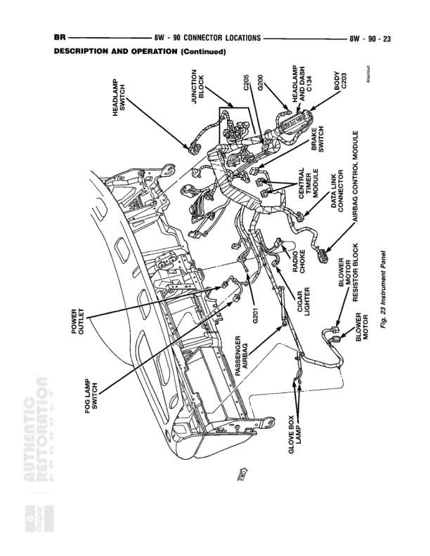

# 8W - 90 CONNECTOR LOCATIONS - DESCRIPTION AND OPERATION (Continued)

**Notes:** This is a connector location diagram showing the physical placement of various electrical components and connectors in the instrument panel and dashboard area. This is a reference diagram (Figure 24 Instrument Panel) and does not show individual wire connections or circuits. It serves as a location guide for service technicians to identify where components and connectors are positioned in the vehicle.

## Components

| Component | Ref | Connectors | Notes |
|-----------|-----|------------|-------|
| HEADLAMP SWITCH | upper left area |  | Located in instrument panel area |
| JUNCTION BLOCK | upper center area |  | Central junction block in instrument panel |
| C356 | upper center | C356 | Connector near junction block |
| C366 | upper center right | C366 | Connector in upper instrument panel area |
| RADIATOR FAN RELAY C 34 | upper right area | C34 | Relay for radiator fan control |
| VELOCITY SENSOR | upper right |  | Vehicle speed sensor location |
| A/C SWITCH | center right |  | Air conditioning switch |
| AIRBAG CONTROL MODULE | center right area |  | For 24 Instrument Panel - located in center console/instrument panel area |
| CENTRAL TIMER MODULE | center area |  | Central timing control module |
| DOOR AJAR SWITCH | center left area |  | Door ajar detection switch |
| BLOWER MOTOR RESISTOR BLOCK | center right lower |  | HVAC blower motor resistor assembly |
| C307 | center area | C307 | Connector in center instrument panel area |
| LIGHTER | center lower area |  | Cigarette lighter assembly |
| RADIO CHOKE | center area |  | Radio noise suppression choke |
| BLOWER MOTOR | right side lower |  | HVAC blower motor assembly |
| POWER OUTLET | lower left area |  | Auxiliary power outlet |
| POLL LAMP SWITCH | lower left area |  | Poll lamp control switch |
| PASSENGER AIRBAG | lower center area |  | Passenger side airbag assembly |
| GLOVE BOX LAMP | lower right area |  | Glove box illumination lamp |
