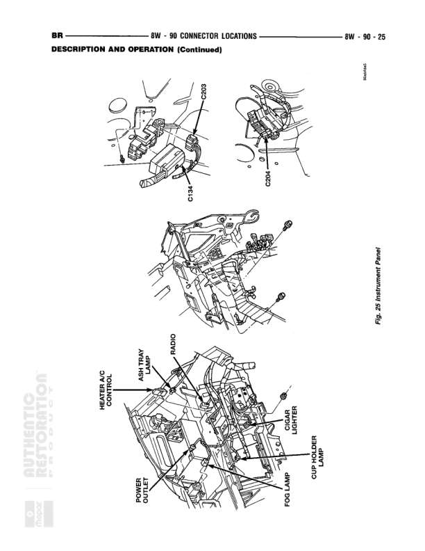

# CONNECTOR LOCATIONS

**Notes:** This diagram shows connector locations throughout the vehicle with physical location illustrations. This is Fig. 25 Instruments Panel reference page showing physical locations of connectors C1, C203, C204, and various components including heater AC control, airbag, power outlet, fog lamp, cigar lighter, cup holder lamp, and odor components. No wire routing or electrical connections are shown in this diagram.

## Components

| Component | Ref | Connectors | Notes |
|-----------|-----|------------|-------|
| C1 | 8W-90-25 | C1 | Located near front of vehicle, top left diagram |
| C203 | 8W-90-25 | C203 | Located near front of vehicle, top middle diagram |
| C204 | 8W-90-25 | C204 | Located near front of vehicle, top right diagram |
| ODOR | 8W-90-25 |  | Located in middle diagram, instrument panel area |
| HEATER AC CONTROL | 8W-90-25 |  | Located in bottom diagram, instrument panel area |
| AIRBAG | 8W-90-25 |  | Located in bottom diagram, instrument panel area |
| POWER OUTLET | 8W-90-25 |  | Located in bottom diagram, lower left area |
| FOG LAMP | 8W-90-25 |  | Located in bottom diagram, center area |
| CIGAR LIGHTER | 8W-90-25 |  | Located in bottom diagram, right side |
| CUP HOLDER LAMP | 8W-90-25 |  | Located in bottom diagram, right side |
