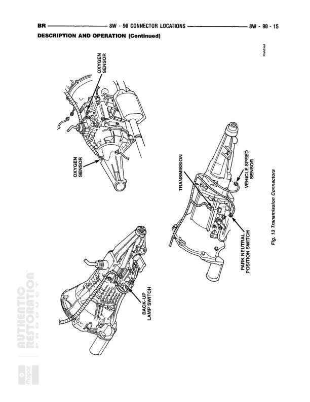

# CONNECTOR LOCATIONS

**Notes:** This is a connector location reference table from section 8W-90-3. It lists connector names/numbers, colors, physical locations, and figure references for various automotive components including fuel injectors, sensors, switches, motors, grounds, and other electrical connections.

## Components

| Component | Ref | Connectors | Notes |
|-----------|-----|------------|-------|
| Front Vertical Seat Motor | Under Seat |  | N/S |
| Fuel Heater (Diesel) | Above Engine Starter Motor |  | Fig. 10 |
| Fuel Injector #1 | At Fuel Injector |  | BK, Fig. 4, 5 |
| Fuel Injector #2 | At Fuel Injector |  | BK, Fig. 4, 5 |
| Fuel Injector #3 | At Fuel Injector |  | BK, Fig. 4, 5, 6 |
| Fuel Injector #4 | At Fuel Injector |  | BK, Fig. 4, 5, 6 |
| Fuel Injector #5 | At Fuel Injector |  | BK, Fig. 4, 5, 6 |
| Fuel Injector #6 | At Fuel Injector |  | BK, Fig. 4, 5, 6 |
| Fuel Injector #7 | At Fuel Injector |  | BK, Fig. 4, 6 |
| Fuel Injector #8 | At Fuel Injector |  | BK, Fig. 4, 6 |
| Fuel Injector #9 | At Fuel Injector |  | BK, Fig. 6 |
| Fuel Injector #10 | At Fuel Injector |  | BK, Fig. 6 |
| Fuel Pump Module | Top of Fuel Tank |  | GY, N/S |
| Fuel Shut Down Relay | On Dash Panel Near Master Cylinder |  | BK, Fig. 2 |
| Fuel Shut Down Solenoid | Near Rear of Injection Pump |  | BK, Fig. 11, 12 |
| Generator | Front of Engine on Cradle |  | BK, Fig. 7, 8 |
| Headlamp Switch C1 | Switch |  | Fig. 20 |
| Headlamp Switch C2 | Rear of Headlamp Switch |  | GY, Fig. 23, 24, 26 |
| Heated Mirror Switch |  |  | N/S |
| High Note Horn | Front Bumper Left Support |  | Fig. 17 |
| Horizontal Seat Motor | At Seat |  | Fig. 18 |
| Idle Air Control Motor | On Throttle Body |  | BK, Fig. 9 |
| Ignition Coil | Right Front of Engine |  | GY, Fig. 4, 5, 9 |
| Ignition Coil 4 Pack | Right Side of Engine |  | BK, Fig. 9 |
| Ignition Coil 6 Pack | Right Side of Engine |  | BK, Fig. 9 |
| Ignition Switch C1 | Steering Column |  | Fig. 24 |
| Ignition Switch C2 | Steering Column |  | Fig. 24 |
| Instrument Cluster C1 | Rear of Instrument Cluster |  | N/S |
| Instrument Cluster C2 | At Instrument Cluster |  | N/S |
| Intake Air Heater | At Intake Heater |  | BK, Fig. 12 |
| Intake Air Heater Relay No. 1 |  |  | N/S |
| Intake Air Heater Relay No. 2 |  |  | N/S |
| Intake Air Temperature Sensor (Diesel) |  |  | Fig. 11 |

## Splices & Grounds

| ID | Type | Location | Wires Connected | Notes |
|----|------|----------|-----------------|-------|
| G100 | ground | Right Side of Engine Side Shield |  | Fig. 16 |
| G101 | ground | Left Fender Side Shield |  | Fig. 16 |
| G102 | ground | Left Fender Side Shield (FINAL Ground) |  | N/S |
| G103 | ground | Near Wiper Motor (Wiper Ground) |  | Fig. 14 |
| G104 | ground | Near Generator (Generator Ground) |  | Fig. 8 |
| G105 | ground | Front of Engine (Engine Ground) |  | Fig. 4, 5, 6, 9 |
| G106 | ground | Front of Engine (Fuel Shut Down Solenoid Ground) |  | N/S |
| G200 | ground | Left Cowl |  | Fig. 23, 24 |
| G201 | ground | I. P. Right Center Support |  | Fig. 23 |
| G300 | ground | Lower Rear Floor |  | Fig. 18 |
| G301 | ground | Below Left Rear Speaker |  | Fig. 18 |
| G302 | ground | At Overhead Console |  | Fig. 20 |
