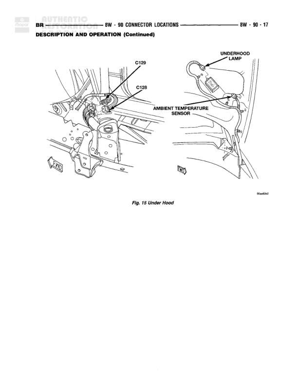

# CONNECTOR LOCATIONS

**Notes:** This is a connector location reference table showing component names, wire colors, physical locations, and figure references. No actual wiring connections are shown in this diagram.

## Components

| Component | Ref | Connectors | Notes |
|-----------|-----|------------|-------|
| Left Tailgate Lamp | Rear of Lamp |  | Color: BK |
| Left Tweeter |  |  | Color: BK, N/S |
| Left Upstream Heated Oxygen Sensor | At Sensor |  | Color: BK, N/S |
| Left Visor/Vanity Lamp | Left A-Pillar |  | Color: BK, N/S |
| Low Note Horn | Front Bumper Left Support |  | Fig. 17 |
| Low Washer Fluid Switch | On Washer Fluid Reservoir |  | Color: BK |
| Manifold Absolute Pressure Sensor | On Throttle Body |  | Color: BK, Fig. 4, 5 |
| Multi-Function Switch | On Steering Column |  | Fig. 24 |
| Overdrive Switch | Rear of Gear Selector Switch |  | Fig. 24 |
| Overhead Console | Behind R/Front of Headliner |  | Color: BK, Fig. 20 |
| Overhead Map/Courtesy Lamp | In Overhead Console |  | Fig. 20 |
| Park/Neutral Position Switch | Left Side of Transmission |  | Color: BK, Fig. 13 |
| Passenger Airbag |  |  | Fig. 23, 26 |
| Passenger Airbag Disarm Switch |  |  | N/S |
| Post Catalyst Heated Oxygen Sensor | At Sensor |  | Color: BK, Fig. 13 |
| Power Outlet | Center of I.P. |  | Color: BK, Fig. 23, 25 |
| Power Seat Switch | Left Side of Driver's Seat |  | N/S |
| Powertrain Control Module | At Powertrain Control Module | C1, C2, C3 | Fig. 1, 2 |
| Pre-Catalyst Heated Oxygen Sensor | At Sensor |  | Color: BK, N/S |
| Radio C1 | Rear of Radio |  | Color: GY, Fig. 25 |
| Radio C2 | Rear of Radio |  | Color: BK, Fig. 25 |
| Radio C3 | LP. Center Support |  | Color: BK, Fig. 23 |
| Relay - Rear Wheel Speed Sensor | Left Frame Rail, Near Fuel Tank |  | Color: BK, Fig. 21, 22 |
| Removable Seat Motor | Below Driver's Seat |  | N/S |
| Right Tweeter |  |  | Color: BK, N/S |
| Right Back-Up Lamp | Rear of Lamp |  | Color: BK, N/S |
| Right Door Disarm Switch |  |  | N/S |
| Right Door Jamb Switch | Rear of Right Door Jamb Switch |  | Color: BK, N/S |
| Right Fog Lamp | Rear of Fog Lamp |  | Color: BK, N/S |
| Right Forward Fender Lamp | Rear of Lamp |  | Color: BK, N/S |
| Right Front Door Speaker(Premium) | Right Door |  | Color: BK, N/S |
| Right Front Door Speaker(Standard) | Right Door |  | Color: BK, N/S |
| Right Front Fender Lamp |  |  | N/S |
| Right Front Wheel Speed Sensor | Right Fender Side Panel |  | Color: BK, Fig. 17 |
| Right Headlamp | At Headlamp |  | Color: BL, N/S |
| Right License Lamp | At Rear |  | Color: BK, Fig. 21 |
| Right Outboard Clearance Lamp | Behind Front of Headliner |  | Color: BK, Fig. 20 |
| Right Outboard Identification Lamp | Behind Front of Headliner |  | Color: BK, N/S |
| Right Park/Turn Signal Lamp | At Lamp |  | Color: BK, N/S |
