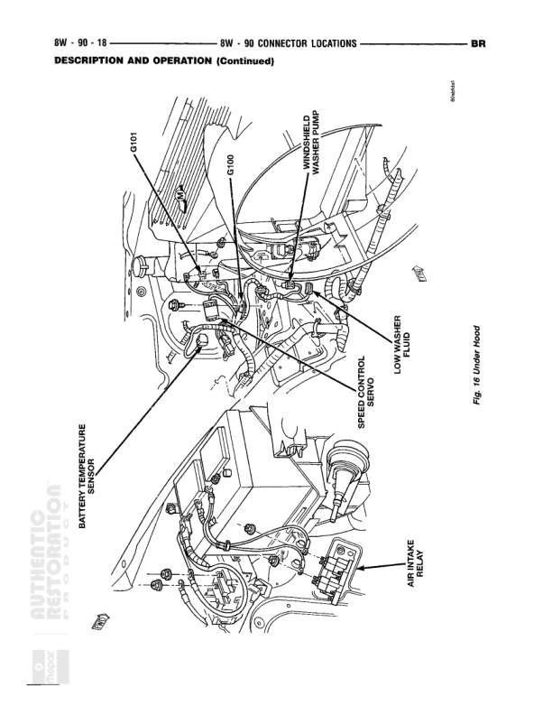

# CONNECTOR LOCATIONS - Description and Operation (Continued)

**Notes:** This is a connector location reference table showing connector colors, physical locations, and figure references for various vehicle components. Page header indicates 8W-90-6 and references BR (Brake) system. This appears to be a continuation page of connector locations.

## Components

| Component | Ref | Connectors | Notes |
|-----------|-----|------------|-------|
| Right Power Door Lock Motor | Right Door |  | BK color connector, N/S fig reference |
| Right Power Door Lock/Window Lift Switch | Right Door |  | BK color connector, N/S fig reference |
| Right Power Mirror Motor | Right Door |  | BK color connector, N/S fig reference |
| Right Power Window Motor | Right Door |  | RD color connector, N/S fig reference |
| Right Rear Fender Lamp | N/S |  | N/S fig reference |
| Right Rear Speaker | 18 |  | Fig 18 reference |
| Right Stop/Hazard and Turn Signal Lamp | Rear of Lamp |  | BK color connector, fig 21 |
| Right Tailgate Lamp | Rear of Lamp |  | BK color connector, N/S fig reference |
| Right Upstream Heated Oxygen Sensor | At Sensor |  | BK color connector, N/S fig reference |
| Right Vapor Canister Vent Solenoid | Right A-Pillar |  | BK color connector, fig 20 |
| Seatbelt Control Module | N/S |  | N/S fig reference |
| Seatbelt Switch | 18 |  | Fig 18 reference |
| Stop Lamp Switch | Top of Brake Pedal Arm |  | GY color connector, fig 23 |
| Throttle Position Sensor | Throttle Body |  | Figs 4, 5 |
| Throttle Position Sensor | On Injection Pump (Diesel) |  | BK color connector, fig 10 |
| Trailer Tow Connector | On Trailer Hitch |  | BK color connector, fig 21 |
| Transmission Output Shaft Speed Sensor | Left Side of Transmission |  | BK color connector, fig 13 |
| Transmission Solenoid Assembly | Side of Transmission |  | BK color connector, fig 13 |
| Under Hood Lamp | Underside of Hood |  | BK color connector, fig 15 |
| Upstream Heated Oxygen Sensor | Exhaust Pipe |  | BK color connector, N/S fig reference |
| Vacuum Sensor (Diesel) | Left Fender Side Shield (Diesel) |  | BK color connector, N/S fig reference |
| Vehicle Speed Control Servo | Below Battery |  | BK color connector, fig 16 |
| Vehicle Speed Control/Horn Switch | Behind Switch |  | BK color connector, N/S fig reference |
| Water-In-Fuel Sensor | Bottom of Fuel Filter/Water Separator |  | BK color connector, fig 11 |
| Windshield Washer Pump Motor | Bottom of Washer Fluid Reservoir |  | BK color connector, fig 16 |
| Windshield Wiper Motor | At Wiper Motor |  | BK color connector, fig 14 |
