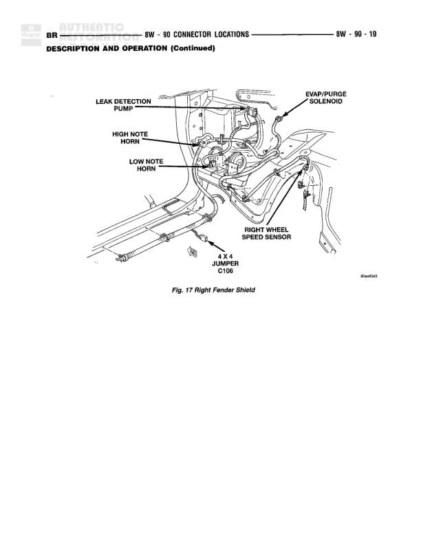

# Dash Panel Connector Locations

**Notes:** This page shows physical connector locations on the dash panel for both Gas and Diesel engine configurations. Fig. 1 shows Gas Engine layout, Fig. 2 shows Diesel Engine layout. The Powertrain Control Module uses three connectors (C3, C2, C1) in both configurations. The Diesel Engine configuration includes an additional Fuel Shutdown Relay not present in the Gas Engine version.

## Components

| Component | Ref | Connectors | Notes |
|-----------|-----|------------|-------|
| Powertrain Control Module | Behind dash panel | C3, C2, C1 | Gas Engine version shown in Fig. 1 |
| Powertrain Control Module | Behind dash panel | C3, C2, C1 | Diesel Engine version shown in Fig. 2 |
| A/C Low Pressure Switch | Behind dash panel |  | Gas Engine |
| A/C Low Pressure Switch | Behind dash panel |  | Diesel Engine |
| Power Distribution Center | Behind dash panel |  | Common to both engine types |
| Fuel Shutdown Relay | Behind dash panel |  | Diesel Engine only |
