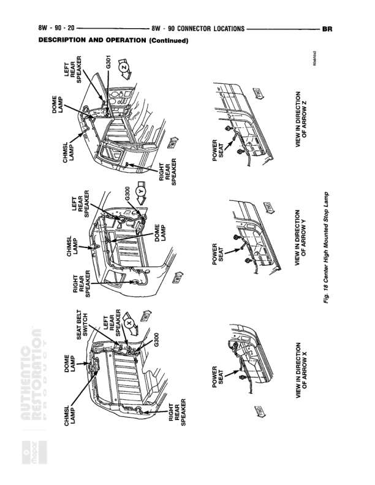

# CONNECTOR LOCATIONS - 3.5/2-6.9 Liter Engines

**Notes:** This is a connector location reference diagram (Description and Operation section) showing physical placement of sensors and components on 3.5/2-6.9 Liter Engines. This is not a wiring diagram with circuit connections. Figure 3.5.2-6.9 Liter Engines. Page labeled 8W-90-8 at top with reference to 8W-90 CONNECTOR LOCATIONS continuing to BR section.

## Components

| Component | Ref | Connectors | Notes |
|-----------|-----|------------|-------|
| Distributor | 8W-90-8 |  | Shown in physical location on engine |
| Crankshaft Position Sensor | 8W-90-8 |  | Shown in physical location on engine |
| Engine Oil Pressure Sensor | 8W-90-8 |  | Shown in physical location on engine, view in direction of arrow R |
| Engine Coolant Temperature Sensor | 8W-90-8 |  | Shown in physical location on engine, view in direction of arrow R |
