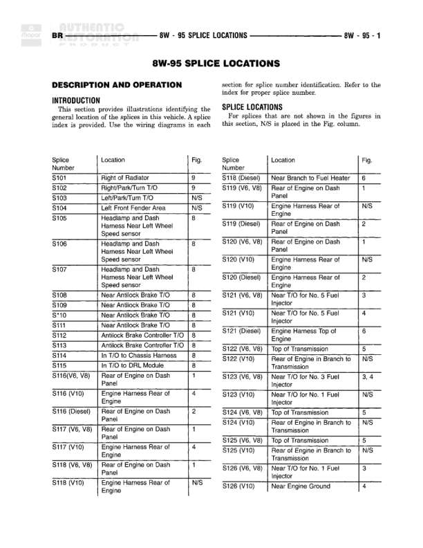

# SPLICE LOCATIONS

**Notes:** This section provides illustrations identifying the general location of the splices in this vehicle. A splice index is provided. Use the wiring diagrams in each section for splice number identification. Refer to the index for proper splice number. For splices that are not shown in the figures in this section, N/S is placed in the Fig. column.

## Splices & Grounds

| ID | Type | Location | Wires Connected | Notes |
|----|------|----------|-----------------|-------|
| S101 | splice | Right of Radiator |  | Figure 9 |
| S102 | splice | Right/Park/Turn T/O |  | Figure 9 |
| S103 | splice | Left/Park/Turn T/O |  | N/S |
| S104 | splice | Left Front Fender Area |  | N/S |
| S105 | splice | Headlamp and Dash Harness Near Left Wheel Speed sensor |  | Figure 8 |
| S106 | splice | Headlamp and Dash Harness Near Left Wheel Speed sensor |  | Figure 8 |
| S107 | splice | Headlamp and Dash Harness Near Left Wheel Speed sensor |  | Figure 8 |
| S108 | splice | Near Antilock Brake T/O |  | Figure 8 |
| S109 | splice | Near Antilock Brake T/O |  | Figure 8 |
| S110 | splice | Near Antilock Brake T/O |  | Figure 8 |
| S111 | splice | Near Antilock Brake T/O |  | Figure 8 |
| S112 | splice | Antilock Brake Controller T/O |  | Figure 8 |
| S113 | splice | Antilock Brake Controller T/O |  | Figure 8 |
| S114 | splice | In T/O to Chassis Harness |  | Figure 8 |
| S115 | splice | In T/O to DRL Module |  | Figure 8 |
| S116(V6, V8) | splice | Rear of Engine on Dash Panel |  | Figure 1 |
| S116 (V10) | splice | Engine Harness Rear of Engine |  | Figure 4 |
| S116 (Diesel) | splice | Rear of Engine on Dash Panel |  | Figure 2 |
| S117 (V6, V8) | splice | Rear of Engine on Dash Panel |  | Figure 1 |
| S117 (V10) | splice | Engine Harness Rear of Engine |  | Figure 4 |
| S118 (V6, V8) | splice | Rear of Engine on Dash Panel |  | Figure 1 |
| S118 (V10) | splice | Engine Harness Rear of Engine |  | N/S |
| S118 (Diesel) | splice | Near Branch to Fuel Heater |  | Figure 6 |
| S119 (V6, V8) | splice | Rear of Engine on Dash Panel |  | Figure 1 |
| S119 (V10) | splice | Engine Harness Rear of Engine |  | N/S |
| S119 (Diesel) | splice | Rear of Engine on Dash Panel |  | Figure 2 |
| S120 (V6, V8) | splice | Rear of Engine on Dash Panel |  | Figure 1 |
| S120 (V10) | splice | Engine Harness Rear of Engine |  | N/S |
| S120 (Diesel) | splice | Engine Harness Rear of Engine |  | Figure 2 |
| S121 (V6, V8) | splice | Near T/O for No. 5 Fuel Injector |  | Figure 3 |
| S121 (V10) | splice | Near T/O for No. 5 Fuel Injector |  | Figure 4 |
| S121 (Diesel) | splice | Engine Harness Top of Engine |  | Figure 6 |
| S122 (V6, V8) | splice | Top of Transmission |  | Figure 5 |
| S122 (V10) | splice | Rear of Engine in Branch to Transmission |  | N/S |
| S123 (V6, V8) | splice | Near T/O for No. 3 Fuel Injector |  | Figure 3, 4 |
| S123 (V10) | splice | Near T/O for No. 1 Fuel Injector |  | N/S |
| S124 (V6, V8) | splice | Top of Transmission |  | Figure 5 |
| S124 (V10) | splice | Rear of Engine in Branch to Transmission |  | N/S |
| S125 (V6, V8) | splice | Top of Transmission |  | Figure 5 |
| S125 (V10) | splice | Rear of Engine in Branch to Transmission |  | N/S |
| S126 (V6, V8) | splice | Near T/O for No. 1 Fuel Injector |  | Figure 3 |
| S126 (V10) | splice | Near Engine Ground |  | Figure 4 |
