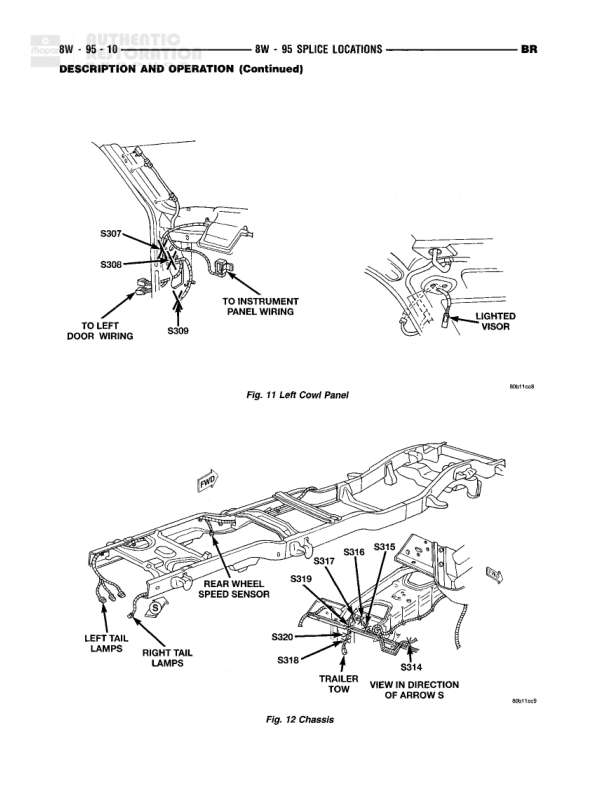

# SPLICE LOCATIONS - DESCRIPTION AND OPERATION (Continued)

**Notes:** This page shows physical splice locations only. Fig. 11 shows left cowl panel area with splices S307, S308, and S309 connecting to instrument panel wiring, left door wiring, and lighted visor. Fig. 12 shows chassis underside view with splices S314-S320 connecting rear wheel speed sensor, tail lamps, and trailer tow wiring. Viewing direction indicated by arrow S for chassis diagram.

## Components

| Component | Ref | Connectors | Notes |
|-----------|-----|------------|-------|
| Left Cowl Panel | Fig. 11 |  | Shows splice locations in left cowl panel area |
| Instrument Panel Wiring | Fig. 11 |  | Connection point for instrument panel wiring |
| Left Door Wiring | Fig. 11 |  | Connection point for left door wiring |
| Lighted Visor | Fig. 11 |  | Located in upper right area of cowl panel |
| Chassis | Fig. 12 |  | Underside chassis view showing splice locations |
| Rear Wheel Speed Sensor | Fig. 12 |  | Located on left side of chassis |
| Left Tail Lamps | Fig. 12 |  | Rear left tail lamp assembly |
| Right Tail Lamps | Fig. 12 |  | Rear right tail lamp assembly |
| Trailer Tow | Fig. 12 |  | Trailer tow connector location on rear chassis |

## Splices & Grounds

| ID | Type | Location | Wires Connected | Notes |
|----|------|----------|-----------------|-------|
| S307 | splice | Left cowl panel area, upper section near door connection |  | Located in left cowl panel near door wiring |
| S308 | splice | Left cowl panel area, middle section |  | Located in left cowl panel |
| S309 | splice | Left cowl panel area, lower section |  | Located in left cowl panel near instrument panel wiring connection |
| S314 | splice | Rear chassis, center area near trailer tow connection |  | View in direction of arrow S, central splice point on chassis |
| S315 | splice | Rear chassis, right side area |  | Located on right side of rear chassis |
| S316 | splice | Rear chassis, right center area |  | Located near center-right of rear chassis |
| S317 | splice | Rear chassis, center area |  | Central splice location on rear chassis |
| S318 | splice | Rear chassis, left center area |  | Located near center-left of rear chassis |
| S319 | splice | Rear chassis, left side area |  | Located on left side of rear chassis |
| S320 | splice | Rear chassis, left side near tail lamps |  | Located near left tail lamps area |
