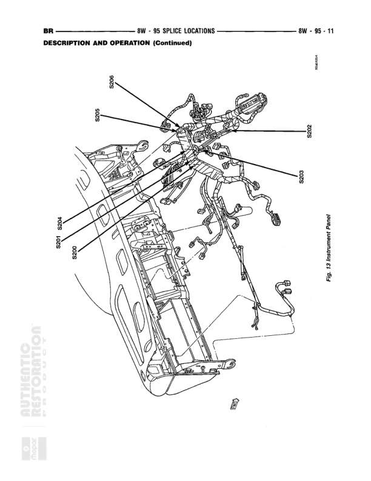

# Splice Locations - Instrument Panel

**Notes:** Fig. 13 Instrument Panel - This is a reference diagram showing physical splice locations within the instrument panel assembly. Not a wiring schematic but a location guide for splices S200-S205.

## Splices & Grounds

| ID | Type | Location | Wires Connected | Notes |
|----|------|----------|-----------------|-------|
| S205 | splice | Upper left area of instrument panel |  | Located in upper left section of IP |
| S203 | splice | Upper center-left area of instrument panel |  | Located in upper center-left section of IP |
| S202 | splice | Upper right area of instrument panel |  | Located in upper right section of IP |
| S201 | splice | Center-left area of instrument panel |  | Located in center-left section of IP |
| S204 | splice | Left lower area of instrument panel |  | Located in lower left section of IP |
| S200 | splice | Center area of instrument panel |  | Located in center section of IP |
