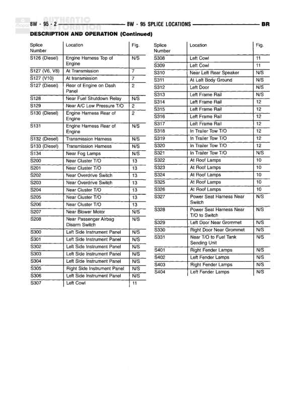

# SPLICE LOCATIONS

**Notes:** This is a splice location reference table showing splice numbers, locations, and corresponding figure numbers. N/S indicates 'Not Shown' for figure references.

## Splices & Grounds

| ID | Type | Location | Wires Connected | Notes |
|----|------|----------|-----------------|-------|
| S126 | splice | Engine Harness Top of Engine |  | Diesel |
| S127 | splice | At Transmission |  | V6, V8 |
| S127 | splice | At Transmission |  | I/6 |
| S127 | splice | Rear of Engine on Dash Panel |  | Diesel |
| S128 | splice | Near Fuel Shutdown Relay |  |  |
| S129 | splice | Near A/C Low Pressure T/O |  |  |
| S130 | splice | Engine Harness Rear of Engine |  | Diesel |
| S131 | splice | Engine Harness Rear of Engine |  |  |
| S132 | splice | Transmission Harness |  | Diesel |
| S133 | splice | Transmission Harness |  | Diesel |
| S134 | splice | Near End Lamp |  |  |
| S200 | splice | Near Cluster T/O |  |  |
| S201 | splice | Near Cluster T/O |  |  |
| S202 | splice | Near Overdrive Switch |  |  |
| S203 | splice | Near Overdrive Switch |  |  |
| S204 | splice | Near Cluster T/O |  |  |
| S205 | splice | Near Cluster T/O |  |  |
| S206 | splice | Near Cluster T/O |  |  |
| S207 | splice | Near Blower Motor |  |  |
| S208 | splice | Near Passenger Airbag Disarm Switch |  |  |
| S300 | splice | Left Side Instrument Panel |  |  |
| S301 | splice | Left Side Instrument Panel |  |  |
| S302 | splice | Left Side Instrument Panel |  |  |
| S303 | splice | Left Side Instrument Panel |  |  |
| S304 | splice | Left Side Instrument Panel |  |  |
| S305 | splice | Right Side Instrument Panel |  |  |
| S306 | splice | Left Side Instrument Panel |  |  |
| S307 | splice | Left Cowl |  |  |
| S308 | splice | Left Cowl |  |  |
| S309 | splice | Engine |  |  |
| S310 | splice | Near Left Rear Speaker |  |  |
| S311 | splice | At Left Roof Lamp |  |  |
| S312 | splice | Left Door |  |  |
| S313 | splice | Left Frame Rail |  |  |
| S314 | splice | Left Frame Rail |  |  |
| S315 | splice | Left Frame Rail |  |  |
| S316 | splice | Left Frame Rail |  |  |
| S317 | splice | Left Frame Rail |  |  |
| S318 | splice | In Trailer Tow T/O |  |  |
| S319 | splice | In Trailer Tow T/O |  |  |
| S320 | splice | In Trailer Tow T/O |  |  |
| S321 | splice | In Trailer Tow T/O |  |  |
| S322 | splice | At Roof Lamps |  |  |
| S323 | splice | At Roof Lamps |  |  |
| S324 | splice | At Roof Lamps |  |  |
| S325 | splice | At Roof Lamps |  |  |
| S326 | splice | At Roof Lamps |  |  |
| S327 | splice | Power Seat Harness Near Switch |  |  |
| S328 | splice | Power Seat Harness Near T/O to Switch |  |  |
| S329 | splice | Left Door Near Grommet |  |  |
| S330 | splice | Right Door Near Grommet |  |  |
| S331 | splice | Near T/O to Fuel Tank Sending Unit |  |  |
| S401 | splice | Right Fender Lamps |  |  |
| S402 | splice | Left Fender Lamps |  |  |
| S403 | splice | Right Fender Lamps |  |  |
| S404 | splice | Left Fender Lamps |  |  |
