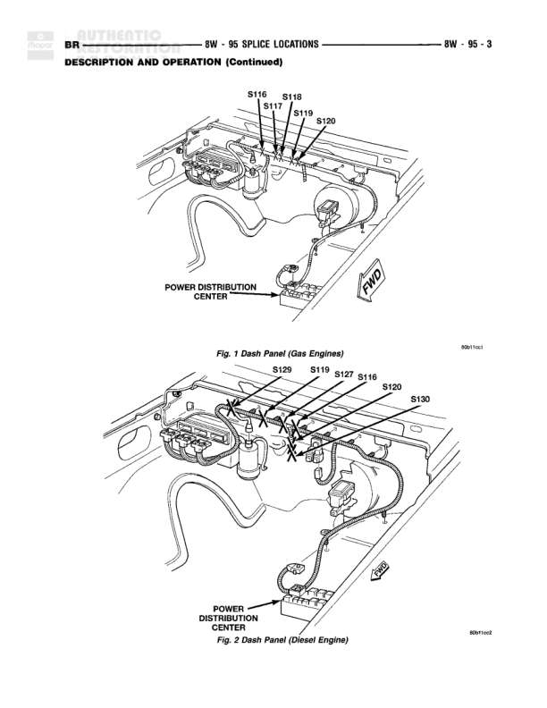

# SPLICE LOCATIONS - Dash Panel (Gas Engine and Diesel Engine)

**Notes:** This diagram shows splice locations in the dash panel area. Figure 1 shows Gas Engine configuration with splices S116, S117, S118, S119, and S120. Figure 2 shows Diesel Engine configuration with splices S116, S119, S120, S127, S129, and S130. The Power Distribution Center is located in the dash panel area for both configurations.

## Components

| Component | Ref | Connectors | Notes |
|-----------|-----|------------|-------|
| Power Distribution Center | Dash Panel |  | Located in dash panel area |

## Splices & Grounds

| ID | Type | Location | Wires Connected | Notes |
|----|------|----------|-----------------|-------|
| S116 | splice | Dash panel area, upper left near instrument cluster |  | Gas Engine configuration |
| S117 | splice | Dash panel area, center near instrument cluster |  | Gas Engine configuration |
| S118 | splice | Dash panel area, upper center-right near instrument cluster |  | Gas Engine configuration |
| S119 | splice | Dash panel area, upper right near instrument cluster |  | Gas Engine configuration |
| S120 | splice | Dash panel area, far right |  | Gas Engine configuration |
| S116 | splice | Dash panel area, upper right (Diesel) |  | Diesel Engine configuration |
| S119 | splice | Dash panel area, center-right near instrument cluster (Diesel) |  | Diesel Engine configuration |
| S120 | splice | Dash panel area, far right (Diesel) |  | Diesel Engine configuration |
| S127 | splice | Dash panel area, upper center-right (Diesel) |  | Diesel Engine configuration |
| S129 | splice | Dash panel area, upper left (Diesel) |  | Diesel Engine configuration |
| S130 | splice | Dash panel area, upper far right (Diesel) |  | Diesel Engine configuration |
