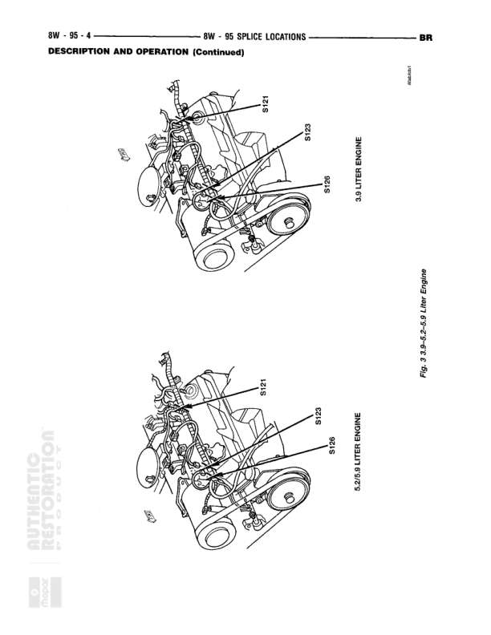

# SPLICE LOCATIONS - DESCRIPTION AND OPERATION (Continued)

**Notes:** This diagram shows physical splice locations in the engine compartment for two different engine configurations: 3.3 Liter Engine (top view) and 5.2/5.9 Liter Engine (bottom view). The splices are shown overlaid on engine compartment illustrations. Page reference indicates 'For 3.3L 5.2L & 5.9 Liter Engine'.

## Splices & Grounds

| ID | Type | Location | Wires Connected | Notes |
|----|------|----------|-----------------|-------|
| S121 | splice | Near top of engine compartment, upper left area |  | 3.3 Liter Engine |
| S123 | splice | Mid-level on engine, left side |  | 3.3 Liter Engine |
| S125 | splice | Lower left area of engine compartment |  | 3.3 Liter Engine |
| S121 | splice | Near top of engine compartment, upper left area |  | 5.2/5.9 Liter Engine |
| S123 | splice | Mid-level on engine, left side near center |  | 5.2/5.9 Liter Engine |
| S129 | splice | Lower left area of engine compartment |  | 5.2/5.9 Liter Engine |
