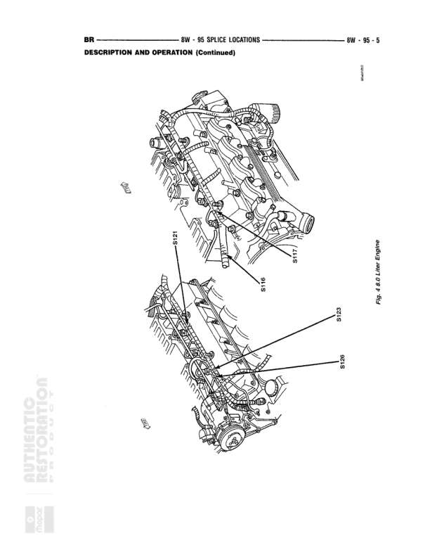

# 95 SPLICE LOCATIONS - DESCRIPTION AND OPERATION (Continued)

**Notes:** This diagram shows physical splice locations on a 4.6L V8 engine. The image displays two views of the engine (top and side) with splice points labeled S107 through S117 and S125. This is a continuation page for splice location reference.

## Splices & Grounds

| ID | Type | Location | Wires Connected | Notes |
|----|------|----------|-----------------|-------|
| S107 | splice | Near top front of engine, right side area |  | Located in upper engine compartment |
| S108 | splice | Front of engine, upper right side |  | Located in upper engine compartment |
| S109 | splice | Right side of engine block, mid-level |  | Located on right side of engine |
| S110 | splice | Lower right side of engine block |  | Located on lower right side of engine |
| S111 | splice | Front lower area of engine |  | Located at front lower section of engine |
| S112 | splice | Lower front of engine, center area |  | Located at lower front of engine |
| S113 | splice | Left lower side of engine block |  | Located on lower left side of engine |
| S114 | splice | Left side of engine block, mid-level |  | Located on left side of engine |
| S115 | splice | Upper left side of engine |  | Located in upper left engine area |
| S116 | splice | Top rear of engine, left side |  | Located at rear upper left of engine |
| S117 | splice | Rear of engine, upper area |  | Located at rear upper section of engine |
| S125 | splice | Right rear area of engine |  | Located at right rear of engine |
