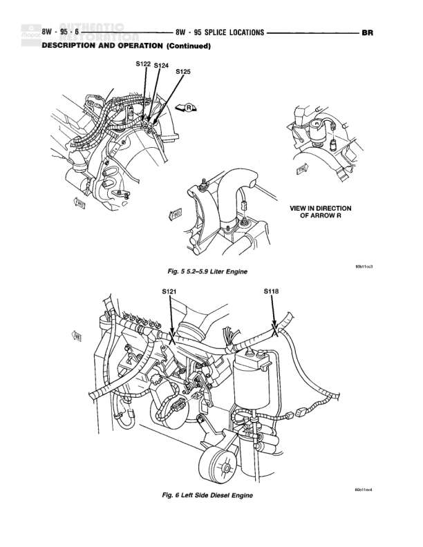

# SPLICE LOCATIONS - DESCRIPTION AND OPERATION (Continued)

**Notes:** This page shows physical splice locations for two engine types: 5.2-5.9 Liter Engine and Left Side Diesel Engine. Diagrams are for reference to locate splices in the engine compartment. VIEW IN DIRECTION OF ARROW R notation indicates viewing angle for one of the splice location diagrams.

## Splices & Grounds

| ID | Type | Location | Wires Connected | Notes |
|----|------|----------|-----------------|-------|
| S122 | splice | 5.2-5.9 Liter Engine - upper area near firewall |  | Located in engine compartment, shown in Fig. 5 |
| S124 | splice | 5.2-5.9 Liter Engine - upper area near firewall |  | Located in engine compartment, shown in Fig. 5 |
| S125 | splice | 5.2-5.9 Liter Engine - upper area near firewall |  | Located in engine compartment, shown in Fig. 5 |
| S121 | splice | Left Side Diesel Engine - upper area near intake manifold |  | Located in engine compartment, shown in Fig. 6 |
| S118 | splice | Left Side Diesel Engine - right side area |  | Located in engine compartment, shown in Fig. 6 |
