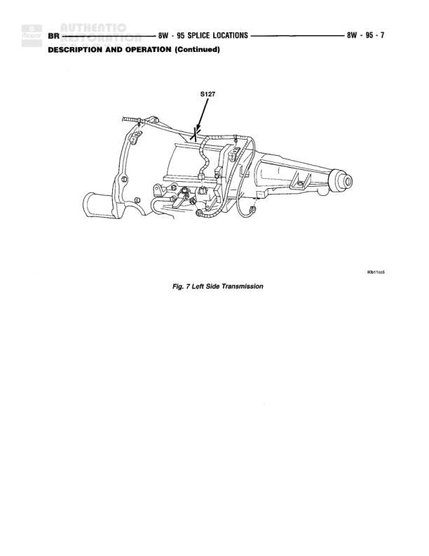

# SPLICE LOCATIONS - Left Side Transmission

**Notes:** This is a splice location reference diagram showing the physical location of splice S127 on the left side of the transmission. This is part of the 'DESCRIPTION AND OPERATION (Continued)' section for splice locations.

## Components

| Component | Ref | Connectors | Notes |
|-----------|-----|------------|-------|
| Transmission | Left Side Transmission |  | Fig. 7 Left Side Transmission - showing splice location S127 |

## Splices & Grounds

| ID | Type | Location | Wires Connected | Notes |
|----|------|----------|-----------------|-------|
| S127 | splice | Left side of transmission assembly, upper area near top of transmission case |  | Splice location shown on left side transmission |
