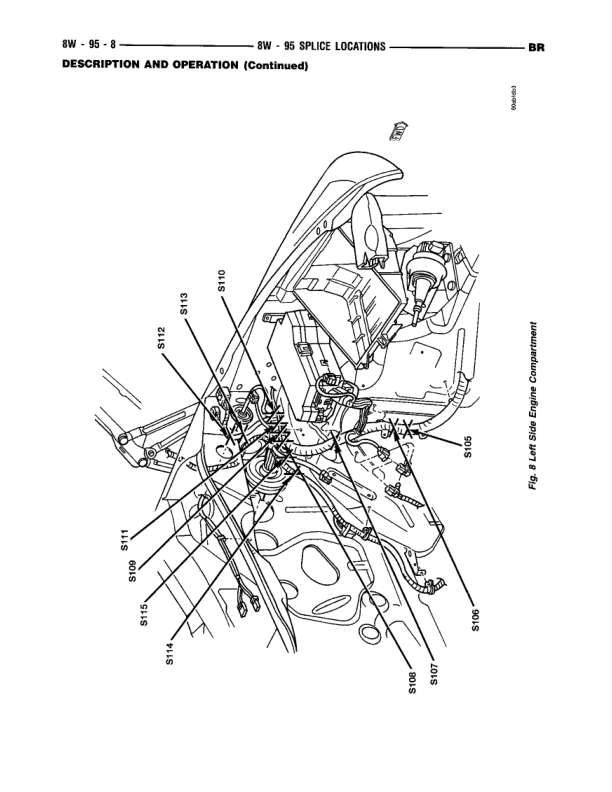

# SPLICE LOCATIONS - DESCRIPTION AND OPERATION (Continued)

**Notes:** This is a physical splice location diagram showing where various splices (S100-S115) are located in the left side and front engine compartment area. This is a reference diagram for locating physical splice points, not an electrical circuit diagram. The view shows the engine compartment from an angled perspective looking down from the driver's side front.

## Splices & Grounds

| ID | Type | Location | Wires Connected | Notes |
|----|------|----------|-----------------|-------|
| S100 | splice | Left front inner fender area, near left side engine compartment |  |  |
| S105 | splice | Right side engine compartment, near firewall |  |  |
| S106 | splice | Right side engine compartment area |  |  |
| S107 | splice | Right side engine compartment, lower area near firewall |  |  |
| S109 | splice | Center of engine compartment, near firewall |  |  |
| S110 | splice | Left side engine compartment area |  |  |
| S111 | splice | Left front area of engine compartment |  |  |
| S112 | splice | Left front corner of engine compartment |  |  |
| S113 | splice | Left front area of engine compartment, near radiator support |  |  |
| S115 | splice | Left front corner of engine compartment, near headlight area |  |  |
