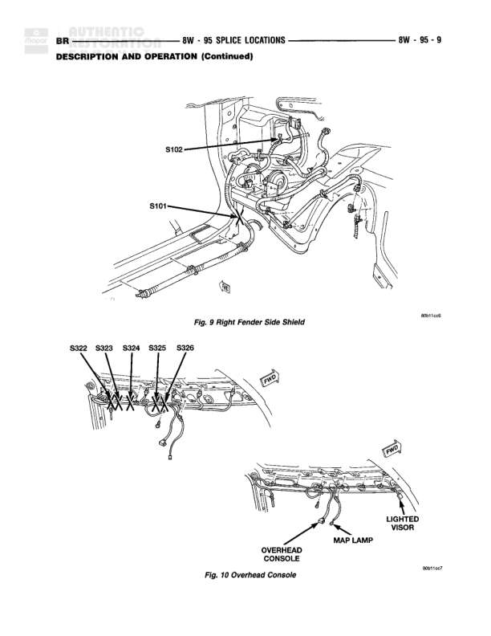

# Splice Locations - Right Fender Side Shield and Overhead Console

**Notes:** This page shows physical splice locations only. Figure 9 shows splices S101 and S102 located in the right fender side shield area. Figure 10 shows splices S322 through S326 located in the overhead console area near the map lamp and lighted visor.

## Components

| Component | Ref | Connectors | Notes |
|-----------|-----|------------|-------|
| Right Fender Side Shield | Fig. 9 |  | Contains splice locations S101 and S102 |
| Overhead Console | Fig. 10 |  | Contains splice locations S322, S323, S324, S325, S326 |
| Map Lamp | Fig. 10 |  | Located in overhead console area |
| Lighted Visor | Fig. 10 |  | Located in overhead console area |

## Splices & Grounds

| ID | Type | Location | Wires Connected | Notes |
|----|------|----------|-----------------|-------|
| S101 | splice | Right fender side shield area |  | Shown in Figure 9 |
| S102 | splice | Right fender side shield area |  | Shown in Figure 9 |
| S322 | splice | Overhead console area |  | Shown in Figure 10 |
| S323 | splice | Overhead console area |  | Shown in Figure 10 |
| S324 | splice | Overhead console area |  | Shown in Figure 10 |
| S325 | splice | Overhead console area |  | Shown in Figure 10 |
| S326 | splice | Overhead console area |  | Shown in Figure 10 |
