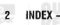

DIESEL ENGINE COMPONENTS, 5.9L ... INJECTION SYSTEM-DIESEL ENGINE. FUEL INJECTION PUMP DATA PLATE 14-31 14-31 14-38
FUEL INJECTION PUMP DATA PLATE 14-31 14-38
FUEL INJECTION PUMP RELAY--ECM DIESEL ENGINE SPECIFICATIONS, 5.9L . . . . . . . 9-82
DIESEL FUEL SYSTEM
DISTANCE-PCM SYSTEM
DISTANCE-PCM IRIPUT, VEHICLE FUEL INJECTION SYSTEM-DIESEL ENGINE, 14-41
FUEL FIFF rice of the less fruel
INLECTORS FUEL
INLET CONNECTORS WATER
INPUT, ACCELERATOR PECIAL POSITION 14-35 1,4-8
INPUT, ACCELERATOR PECIAL POSITION 14-47 OUTPUT PUMP TIMING TIMING . . . . . . . . . . . . . . . . . . . . . . . . . . . . . . . . . . . . . . . . . . . . . . . . 14-18
FUEL INJECTION SYSTEM-DIESEL SPEED . DISTRIBUTION: 800-10 POWER ... . . . . . 14-51 8-1
DISTRIBUTION, 8W-15 GROUND - SAMER FUEL INJECTION SYSTEM-DIESEL SENSOR (APPS)—ECM
CONTROLS—PCM
CONTROLS—PCM
NPUT AND OUTPUT, DATA LINK DRAINING AT FUEL FILTER, WATER . . . . . . 14-20 CONNECTOR-PCMECM SENSE - POMATIC SHUTDOWN (ASSD)
INFUT, BATTERY TEMPERATURE SENSOR - POM - POM - 14-50
INPUT, BATTERY VOLTAGE - ECM - 14-60
INPUT, BATTERY VOLTAGE-- PCM
INPUT, CAMSHAFT POSITION SENSOR FIELD ... . . . . . . . . . . . . . . . . . . . . . . . . . . . . . . . . . . . . . . . . . . . . . . . . . . . . . . . . . . . . . . . . . 80-2
ELEMENT, AIR CLEANER HOUSING/ INPUT, CRANKSHAFT POSITION SENSOR INPLIT FRIGINE COOLANT ELEMENT AND GASKET, OIL COOLER ... . . . . 14-22 ·· ENGINES
FUEL TANK
FUEL TANK CAPACITY—DIESEL ENGINE 14-214-39
FUEL TANK MODULLE
FUEL TANK MODULLE
FUEL TEMPERATURE SENSOR TEMPERATURE (ECT) SENSOR---POM - ELEMENTS, INTAKE MANIFOLD AIR 14-48 HEATER FUEL TRANSFER ILIFT) PUMP
FUEL TRANSFER PUMP FUEL TRANSFER PUMP PRESSURE TEST 14-37
FUEL TRANSFER PUMP PRESSURE TEST 14-11 (MAP) SENSOR-ECM
INPUT, Oil PRESSURE SENSOR FUEL AGNITION SYSTEMS, 8W-30 - (ENGINE)-ECM .. SENSOR. INPUT, OVERDRIVE/OVERRIDE ENGINE COOLANT TEMPERATURE (ECT) SWITCH-PCM . 14-46
ENGINE DESCRIPTION, 5.9L DIESE.
ENGINE DESCRIPTION, 5.9L DIESE.
ENGINE DIAGNOSIS—MECHANICAL
PAGINE FUEL DELIVERY SYSTEM-
DIFSEL GEAR (CAMSHAFT REMOVED). INPUT, PARK/NEUTRAL POSITION SWITCH - PTO SWITCH SENSE-- ECM -- 14-50
INPUT, SPEED CONTROL SWITCHES--- CAMSHAFT
GEAR HOUSING COVER
GEAR HOUSING COVER
GENERAL INFORMATION: FUEL SYSTEM INPUT, TRANSMISSION GOVERNOR ENGINE, FUEL DELIVERY SYSTEM- INTRODUCTION . INPUT, TRANSMISSION TEMPERATURE DIESE! ENGINE, FUEL INJECTION SYSTEM- ALENSOR - POM - POM - GENERATOR DIESEL ENGINE, FUEL INJECTION SYSTEM --- -- - - 14-41
-- DIESPI GENERATOR FIELD DRIVER (-)-POM 80-2 DIESSEL OUTPUT ... . . 14-42 ENGINE, FUEL REQUIREMENTS-DIESEL . . 14-14-1 GENERATOR FIELD SOURCE (+)-POM OUTPUT
GENERATOR LAMP　PCM OUTPUT
GENERATOR RATINGS
GOVERNOR PATINGS
GOVERNOR PRESSURE SENSOR—POM INPUT, WATER-IN-FUEL WARNING INPUT, WATER-IN-FUEL (WIF) -------------------------- GRADING PROCEDURE PISTON . CALL COLLECT OF ONLINDER
CALLER CLEANS INDER ANDER AND AND A SENSOR. ENGINES, FUEL SYSTEM PRESSURES- 14-47
DIESEI INTAKE MANIFOLD AIR HEATER 14-39 EXHAUST MANIFOLD ... .... 11-14,11-8 ELEMENTS . 12 2018 10:21 12 12 12 12 12 12 12 12 14 12 12 14 12 12 14 12 14 12 12 1
14 12 10 10 10 10 12 12 14 12 INTAKE MANIFOLD AIR HEATER RELAYS ... 14-59 EXHAUST PIPE EXHAUST NISE INTAKE MANIFOLD AIR HEATER EXHAUST SYSTEM DIAGNOSIS CHART ... . 11-4
FAN AND VISCOLLS DRIVE INTAKE MANIFOLD AIR HEATERS
INTAKE MANIFOLD AIR TEMPERATURE FAN AND VISCOUS DRIVE. COOLING INTAKE MANIFOLD AIR TEMPERATURE (IAT) SENSOR-ECM INIPUT .. INTAKE SYSTEM DIAGNOSIS. GENERATOR -------------- HIGH-PRESSURE FUEL LINE LEAK TEST . . . . 14-17 FIELD SOURCE (+)-PCM OUTPUT, GENERATOR
FILTER SERVICE, ENGINE OIL / 
FILTER, WATER IPANNING AT FUEL TURBOCHARGER / AIR . . ......... 11-4 HOSES AND CLAMPS, COOLING SYSTEM ... 7-7 INTRODUCTION: LUBRICATION AND INTRODUCTION: SPEED CONTROL -- HOUSING COVER, GEAR .. FITTINGS, QUICK-CONNECT HOUSING, GEAR SYSTEM . ------------ .. FLUSHING CONNING Excellent JOURNAL CLEARANCE, CONNECTING HOUSING/AIR CLEANER ELEMENT, AIR FLUSHING, COOLING SYSTEM CLEANER ·· IDENTIFICATION, ENGINE JUNCTION BLOCK, 8W-12 FUEL DELIVERY SYSTEM-DIESEL LAMP (MIL), MALFUNCTION INDICATOR ... IDENTIFICATION NUMBER, VEHICLE - - - - Intro -1
INDEX, 8W-02 CXIMPONIFAT ........... 14-2 FUEL DELIVERY SYSTEM-DIESEL INDEX. 8W-02 COMPONENT LAMP SWITCH, STOP . . . 8H-2,8H-5 . 14-7 INDICATOR LAMP (MIL), MALFUNCTION LAMP-ECM INPUT, WATER-IN-FUEL FNONE FUEL DRAIN MANIFOLD INDICATOR LAMP-ECM/PCM OUTPUT, WARNING .. . . . 14-49 FUEL FILTER WATER SEPARATOR AT - - 14-20
FUEL FILTER WATER SEPARATOR AT - - 14-24.14-28
FUEL FILTER WATER SEPARATOR - - - - 14-24.14-6
FUEL DIALGE SENDING LINT NALFUNCTION LAMP-ECM OUTPUT, WAIT-TO-START INJECTION PUMP DATA PLATE, FUEL WARNING . ·· INJECTION PUMP RELAY-ECM LAMP-ECM/PCM OUTPUT, FUEL GAUGE SENDING UNIT . MALFUNCTION INDICATOR .. .. LAMP-PCM OUTPUT, GENERATOR ... . . . . 14-51 OUTPUT, FUEL . LAMP-PCM OUTPUT, OVERDRIVE ... ... . . . . 14-52 FUEL HEATER RELAY

*Fig. 1*

002

ાન્ડ O D Group-Page

Description

Description

Group-Page

Group-Page
