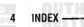

SENSOR (CMP), CAMPINET POSITION -PCM INPUT, PARK/NEUTRAL TORQUE CHART: SPEED CONTROL SWITCH POSITION STSTER ········· TORQUE CHART-DIESEL ENGINE SWITCH-PCM INPUT, OVERDRIVE/ - TORQUE CONVERTOR CLUTCH (TOC) SYSTEML 8W-20 CHARGING TORQUE SPECIFICATIONS: 5.9L ............... 8-1 SYSTEM, BW-21 STARTING TEMPERATURE (ECT) INPUT, OIL 24-VALVE TURBO DIESEL ENGINE SYSTEM, AIR IN FUEL . ....... 9-83 SYSTEM CIRCULATION, COOLING TORQUE SPECIFICATIONS: EXHAUST SYSTEM AND TURBOCHARGER ... .. PRESSURE .. FUEL TEMPERATURE ... . . . . . . . 14-4 TRANSFER (UMP, FUEL
TRANSFER PUMP, FUEL
TRANSFER PUMP PRESSURE TEST, SYSTEM CLEANING/REVERSE FLUSHING, ... . . . 7-2 SYSTEM COMPONENTS, CODLING ... . . . . . 7-2 SENSOR, INTACE MANIFOLD AIR TEMPERATURE (IAT) .. SENSOR, MANIFOLD AIR PRESSURE SYSTEM, COOLANT RESERVE/ and . TRANSMISSION GOVERNOR PRESSURE SYSTEM, COOLING .. (MAP) (MAP) 01) PRESSUPE
 SENSOR WATER (N-FUEL
 SENSOR WATER (N-FUEL
 SENSOR FEM IN-FUEL SENSOR-POM INPUT ... ... . SYSTEM DIAGNIPTION
SYSTEM DIMBRIS CHART, EXHANST EXHAUST
SYSTEM DIAGNIDSIS, COLOLING
SYSTEM DIAGNOSIS, COOLUNG
AIR INTRE ALDOS IARY . TRANSMISSION OIL COOLERS. TRANSMISSION TEMPERATURE MANIFOLD AJR TEMPERATURE (IAT) . . . . 14-46 SYSTEM, DIESEL FUEL ... . 11-5 SENSOR-PCM INPUT SYSTEM, DRAINING COOLING COOLING ... . SENSOR-ECM INPUT, MANIFOLD AIR TRANSMISSION TEMPERATURE PRESSURE (MAP) WARNING LAMP―PCM OUTPUT
TROUBLE CODES. DIAGNDSTIC
TUBE. OIL PAN AND SUCTION
TUBE. OIL PAN AND SUCTION
TURBOCHARGER SENSOR-ECM INPUT, WATER-IN-FUEL 14-47 SYSTEM FOR LEAKS, TESTING COOLING - SENSOR-PCM INPUT, BATTERY .. . 7-17 . SYSTEM HOSES AND CLAMPS, COOLING . . . . 7-7 TEMPERATURE
SENSOR—PCM INPUT, FUEL LEVEL LEVEL
SENSOR—PCM INPUT, FRANSMISSION SYSTEM OPERATION, CHARGING ... TURBOCHARGER / AIR INTAKE SYSTEM SYSTEM PARTS. CLEANING FUEL .. DIAGNOSIS . TURBOCHARGER SHUT-DOWN GOVERNOR PRESSURE .. . . . . . 14-51 SENSOR-PCM INPUT, TRANSMISSION
TEMPERATURE SYSTEM PRESSURES-DIESEL PROCEDITIRE UNIT, FUEL GAUGE SENDING ... . SYSTEM, REFILLING COOLING ... 14.55 SEPARATOR, FUEL FILTER/WATER ... . 14-24,14-6 UNSCHEDULED INSPECTION ........................... 0-1 VACUUM PUMP OUTPUT ............................................................................................... 9-6,9-70 SYSTEM-DIESEL ENGINE, FUEL SERVO CARLE SHAFT, SOCKED CONTROL . . . . . . . . . . 8H-1,8H-2 DELIVERY VACUUM SUPPLY SYSTEM DIESEL ENGINE, FUEL SHAFT, ROCKER ARM ... .. . VALVE AND SPRING, OIL PRESSURE ... ... . . 8H-2 SHIFILOS, HEAT WIFCTION SHUTDOWN (ASD) RELAY-POM SYSTEM ___ DIESEL ENGINE, FUEL REGULATOR .. WALVE LASH VERIFICATION & SHUTDOWN (ASD) SENSE-PCM INPUT, DELWERY . . . . 14-51 VALVE, OVERFLOW ........ 14-10,14-3 SYSTEM-DIESEL ENGINE, FLEL CONTININ 14-8-1
SYSTEMS, BN-30 FUELIGNITION - 14-8-1 B-14-8-1
TAILPIPE SHUT-DOWN PROCEDURE VALVE, ROLLOVER VALVE SPRINGS AND SEALS (IN TURBOCHARGER .. ·· VALVE SPRINGSS, VALVES
VALVE SPRINGS VALVES SMOKE DIAGNOSIS CHARTS TANK CAPACITY-DIESEL ENGINE, FUEL
TANK, FUEL ... .. 11-7 SOLENDID-PCM OUTBET TO TANK MODULE. FUEL
TAPPETS CONVERTOR CLUTCH (TCC) ...... SOLENOIDS-POM OUTPUT, SPEED TAPPETS VALVES, SPRINGS, AND SEALS (OFF
VEHICLE IDENTIFICATION MUMBER TEMPERATURE (ECT) SENSOR, ENGINE CONTROL .. GENERATOR FIELD COOLANT.
TEMPERATURE (ECT) SENSOR-ECM SPECIFICATIONS, 5.9L DIESEL ENGINE . . . . . . . 9-88
SPECIFICATIONS, TOROLIE: $.9L
SPECIFICATIONS, TORBO DIESEL ENGINE IMPUT, ENGINE COOLANT . INPUT ----- 14-46 TEMPERATURE (IAT) SENSOR, INTAKE 1901 11 VEHICLE SPEED INPUT MANIFOLD AIR . SYSTEM AND TURBOCHARGER .. VERIFICATION & ADJUSTMENT, VALVE TEMPERATURE (MT) SENSOR--ECM
TEMPERATURE SENSOR---ECM
TEMPERATURE SENSOR LASH . VISCOUS DRIVE. COOLING FAN SPEED AND DISTANCE-PCM INPUT, SPEED CONTROL SERVO
SPEED CONTROL SOLENOID CIPICUITS 8H-1,8H-1 VOLTAGE-PCM INPUT, BATTERY TEMPERATURE SENSOR-POM INPUT. SPEED CONTROL SOLENOIDS-PCM FCM TRANSMISSION
TEMPERATURE WARNING LAMP- OUTPUT
SPEED CONTROL SWITCHES -- PCM WAIT-TO-START WARNING LAMP-ECM ... . . 14-50 OUTPUT OUTPUT, TRANSMISSION
TENSION, ACCESSORY DRIVE BELT ... WARNING, FUEL SYSTEM PRESSURE ... . . . . 14-6
WARNING LAMP... FC14 INDUT SPEED INPUT VEHICLE ... TENSIONER, ACCESSORY DRIVE BELT .. 7-25 7-5 WARNING LAMP-ECM INPUT, WARNING LAMP-ECM OUTPUT, ........ 14-49 TEST, FUEL HEATER
TEST, FUEL HEATER
TEST, FUEL INJECTOR SPRING, OIL PRESSURE REGULATOR ... . . . 8H-2. VALVE WARNING LAMP-PCM OUTPUT ·· SPRINGS AND SEALS (IN VEHICLE). . . . . . 9-57,9-80 TEST, FUEL TRANSFER PUMP
PRESSURE
TEST, HIGH PRESSURE FUEL LINE LEAK TRANSMISSION TEMPERATURE ... ... . VALVE .... . . . 9-31 SPRINGS, AND SEALS (OFF VEHICLE). WASTEGATE ADJUSTMENT VALVES VALVES AND VALVE .. TEST, PADIATOR COOLANT FLOW
TESTING COOLING SYSTEM FOR LEAKS WATER DRAINING AT FUEL FILTER . WATER PUMP INSPECTION TEST-FUEL HEATER, PIELAY ... . WATER-IN-FLIEL SENSOR SUPPLY VACHUM THROTTLE CABLE SUFPLY, VALUUM
SWIPDK SHIUB, COOLING FAN
SWITCH SINSE -- ECM INPUT, PTO WATER-IN-FUEL WARNING LAMP-ECM 14-60 INPUT TIMING, FUEL INJECTION PUMP ... . . . . . 14-18 · WATER-IN-FUEL (WIF) SENSOR-ECM TONE WHEEL. CRANKSHAFT ... INPUT . WATER-TO-OIL COOLER
WHEEL, CRANKSHAFT TONE TOROLE SWITCHES-PCM INPUT, SPEED TORQUE CHART; CHARGING SYSTEM ... CONTROL ..

*Fig. 1*

mopo

1011633 Group-Page

Group-Page

Group-Page
