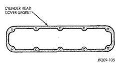

# BR 5.9L ENGINE 9-101

## REMOVAL AND INSTALLATION (Continued)

(16) Connect the fuel supply line.
(17) Connect the power steering hoses, if equipped.
(18) Connect the heater hoses.
(19) Install the distributor cap and wiring.
(20) Install the intake manifold. Refer to Group 11, Exhaust System and Intake Manifold.
(21) Using a new gasket, install throttle body. Tighten the throttle body bolts to 23 N·m (200 in. lbs.) torque.
(22) Connect the throttle linkage.
(23) Install the air cleaner resonator and duct work.
(24) Install the generator and wire connections (refer to Group 8B, Battery/Starter/Generator Service).
(25) Install a/c compressor and lines.
(26) Install the accessory drive belt (refer to Group 7, Cooling System).
(27) Install upper radiator support crossmember.
(28) Install radiator (refer to Group 7, Cooling System).
(29) Connect the radiator lower hose.
(30) Connect the transmission oil cooler lines to the radiator.
(31) Install the fan shroud.
(32) Install the fan.
(33) Connect the radiator upper hose.
(34) Install the washer bottle.
(35) Install the transmission oil cooler.
(36) Connect the transmission cooler lines.
(37) If equipped, install the condenser.
(38) Evacuate and charge the air conditioning system, if equipped (refer to Group 24, Heating and Air Conditioning for service procedures).
(39) Add engine oil to crankcase. Refer to Group 0, Lubrication and Maintenance for the correct fill capacity.
(40) Add coolant to the cooling system (refer to Group 7, Cooling System for the proper procedure).
(41) Connect battery negative cable.
(42) Start engine and inspect for leaks.
(43) Road test vehicle.

## CYLINDER HEAD COVER

A steel backed silicon gasket is used with the cylinder head cover (Fig. 17). This gasket can be used again.

### REMOVAL

(1) Disconnect the negative cable from the battery.
(2) Disconnect closed ventilation system and evaporation control system from cylinder head cover.
(3) Remove cylinder head cover and gasket. The gasket may be used again.

*Fig. 17 Cylinder Head Cover Gasket - Shows gasket outline with bolt holes, labeled "CYLINDER HEAD COVER GASKET" and reference number "J9209-105"]*

### INSTALLATION

(1) Clean cylinder head cover gasket surface.
(2) Clean head rail, if necessary.
(3) Inspect cover for distortion and straighten, if necessary.
(4) Check the gasket for use in head cover installation. If damaged, use a new gasket.
(5) Position the cylinder head cover onto the gasket. Tighten the bolts to 11 N·m (95 in. lbs.) torque.
(6) Install closed crankcase ventilation system and evaporation control system.
(7) Connect the negative cable to the battery.

## ROCKER ARMS AND PUSH RODS

### REMOVAL

(1) Disconnect spark plug wires by pulling on the boot straight out in line with plug.
(2) Remove cylinder head cover and gasket.
(3) Remove the rocker arm bolts and pivots (Fig. 18). Place them on a bench in the same order as removed.
(4) Remove the push rods and place them on a bench in the same order as removed.

*Fig. 18 Rocker Arms - Shows rocker arms assembly with labeled components:*

### INSTALLATION

(1) Rotate the crankshaft until the "V8" mark lines up with the TDC mark on the timing chain case cover. This mark is located 147° ATDC from the No.1 firing position.
(2) Install the push rods in the same order as removed.