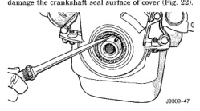

# REMOVAL AND INSTALLATION (Continued)

(6) Install rocker arm.

(7) Install cylinder head cover.

(8) Install distributor, start engine and reset timing.

**CAUTION:** To prevent damage to valve mechanism, engine must not be run above fast idle until all hydraulic tappets have filled with oil and have become quiet.

## VIBRATION DAMPER

### REMOVAL

(1) Disconnect the battery negative cable.

(2) Remove the cooling system fan.

(3) Remove the cooling fan shroud.

(4) Remove the accessory drive belt (refer to Group 7, Cooling System).

(5) Remove the vibration damper pulley.

(6) Remove vibration damper bolt and washer from end of crankshaft.

(7) Install bar and screw from Puller Tool Set C-3688. Install 2 bolts with washers through the puller tool and into the vibration damper (Fig. 20).

*Fig. 20 Vibration Damper Assembly*

(8) Pull vibration damper off of the crankshaft.

### INSTALLATION

(1) Position the vibration damper onto the crankshaft.

(2) Place installing tool, part of Puller Tool Set C-3688 in position and press the vibration damper onto the crankshaft (Fig. 21).

(3) Install the crankshaft bolt and washer. Tighten the bolt to 183 N·m (135 ft. lbs.) torque.

(4) Install the crankshaft pulley. Tighten the pulley bolts to 28 N·m (200 in. lbs.) torque.

(5) Install the accessory drive belt (refer to Group 7, Cooling System).

(6) Position the fan shroud and install the bolts. Tighten the retainer bolts to 11 N·m (95 in. lbs.) torque.

(7) Install the cooling fan.

(8) Connect the battery negative cable.

*Fig. 21 Installing Vibration Damper*

## TIMING CHAIN COVER

### REMOVAL

(1) Disconnect the negative cable from the battery.

(2) Drain cooling system (refer to Group 7, Cooling System).

(3) Remove the serpentine belt (refer to Group 7, Cooling System).

(4) Remove water pump (refer to Group 7, Cooling System).

(5) Remove power steering pump (refer to Group 19, Steering).

(6) Remove vibration damper.

(7) Loosen oil pan bolts and remove the front bolt at each side.

(8) Remove the cover bolts.

(9) Remove chain case cover and gasket using extreme caution to avoid damaging oil pan gasket.

(10) Place a suitable tool behind the lips of the oil seal to pry the oil seal outward. Be careful not to damage the crankshaft seal surface of cover (Fig. 22).

*Fig. 22 Removal of Front Crankshaft Oil Seal]*

### INSTALLATION

(1) Be sure mating surfaces of chain case cover and cylinder block are clean and free from burrs.

(2) The water pump mounting surface must be cleaned.

(3) Using a new cover gasket, carefully install chain case cover to avoid damaging oil pan gasket. Use a small amount of Mopar® Silicone Rubber Adhesive Sealant, or equivalent, at the joint between tim-