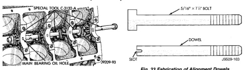
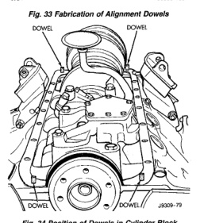

# REMOVAL AND INSTALLATION (Continued)

*Fig. 32 Camshaft Bearings Removal/Installation with Tool C-3132-A]*
- SPECIAL TOOL C-3132-A
- MAIN BEARING OIL HOLE
- P209-93

### INSTALLATION

(1) Install new camshaft bearings with Camshaft Bearing Remover/Installer Tool C-3132-A by sliding the new camshaft bearing shell over proper adapter.

(2) Position rear bearing in the tool. Install horseshoe lock and by reversing removal procedure, carefully drive bearing shell into place.

(3) Install remaining bearings in the same manner. Bearings must be carefully aligned to bring oil holes into full register with oil passages from the main bearing. If the camshaft bearing shell oil holes are not in exact alignment, remove and install them correctly. Install a new core hole plug at the rear of camshaft. **Be sure this plug does not leak.**

## OIL PAN

### REMOVAL

(1) Disconnect the negative cable from the battery.

(2) Remove engine oil dipstick.

(3) Raise vehicle.

(4) Drain engine oil.

(5) Remove exhaust pipe.

(6) Remove left engine to transmission strut.

(7) Loosen the right side engine support bracket cushion through-bolt nut and raise the engine slightly. Remove oil pan by sliding backward and out.

(8) Remove the one-piece gasket.

### INSTALLATION

(1) Clean the block and pan gasket surfaces.

(2) Trim or remove excess sealant film in the rear main cap oil pan gasket groove. DO NOT remove the sealant inside the rear main cap slots.

(3) If present, trim excess sealant from inside the engine.

(4) Fabricate 4 alignment dowels from 5/16 x 1 1/2 inch bolts. Cut the head off the bolts and cut a slot into the top of the dowel. This will allow easier installation and removal with a screwdriver (Fig. 33).

(5) Install the dowels in the cylinder block (Fig. 34).

*Fig. 33 Fabrication of Alignment Dowels]*
- 5/16" x 1 1/2 BOLT
- DOWEL

[Figure: Fig. 34 Position of Dowels in Cylinder Block]
- DOWEL
- DOWEL
- 3329-79

(6) Apply small amount of Mopar® Silicone Rubber Adhesive Sealant, or equivalent in the corner of the cap and the cylinder block.

(7) Slide the one-piece gasket over the dowels and onto the block.

(8) Position the oil pan over the dowels and onto the gasket.

(9) Install the oil pan bolts. Tighten the bolts to 24 N·m (215 in. lbs.) torque.

(10) Remove the dowels. Install the remaining oil pan bolts. Tighten these bolts to 24 N·m (215 in. lbs.) torque.

(11) Lower the engine into the support cushion brackets and tighten the through bolt nut to the proper torque.

(12) Install the drain plug. Tighten drain plug to 34 N·m (25 ft. lbs.) torque.

(13) Install the engine to transmission strut.

(14) Install exhaust pipe.

(15) Lower vehicle.

(16) Install dipstick.