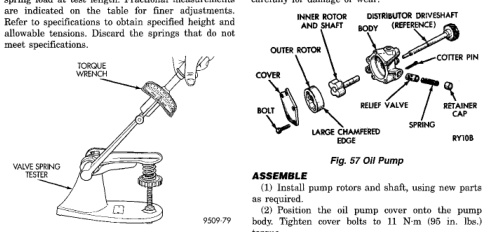
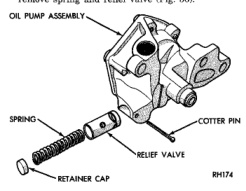

# DISASSEMBLY AND ASSEMBLY (Continued)

instant. Multiply this reading by 2. This will give the spring load at test length. Fractional measurements are indicated on the table for finer adjustments. Refer to specifications to obtain specified height and allowable tensions. Discard the springs that do not meet specifications.

*Fig. 55 Testing Valve Spring for Compressed Length]*
- VALVE SPRING TESTER

## OIL PUMP

### DISASSEMBLE

(1) Remove the relief valve as follows:

(a) Remove cotter pin. Drill a 3.175 mm (1/8 inch) hole into the relief valve retainer cap and insert a self-threading sheet metal screw.

(b) Clamp screw into a vise and while supporting oil pump, remove cap by tapping pump body using a soft hammer. Discard retainer cap and remove spring and relief valve (Fig. 56).

*Fig. 56 Oil Pressure Relief Valve]*
- OIL PUMP ASSEMBLY
- SPRING
- COTTER PIN
- RELIEF VALVE
- RETAINER CAP
- RH174

(2) Remove oil pump cover (Fig. 57).

(3) Remove pump outer rotor and inner rotor with shaft (Fig. 57).

(4) Wash all parts in a suitable solvent and inspect carefully for damage or wear.

[Figure: Fig. 57 Oil Pump]
- INNER ROTOR AND SHAFT
- DISTRIBUTOR DRIVESHAFT (REFERENCE)
- OUTER ROTOR
- COTTER PIN
- COVER
- RELIEF VALVE
- RETAINER SPRING
- BOLT
- LARGE CHAMFERED EDGE
- RY108
- TORQUE WRENCH

### ASSEMBLE

(1) Install pump rotors and shaft, using new parts as required.

(2) Position the oil pump cover onto the pump body. Tighten cover bolts to 11 N·m (95 in. lbs.) torque.

(3) Install the relief valve and spring. Insert the cotter pin.

(4) Tap on a new retainer cap.

(5) Prime oil pump before installation by filling rotor cavity with engine oil.

## CLEANING AND INSPECTION

### CYLINDER HEAD ASSEMBLY

#### CLEANING

Clean all surfaces of cylinder block and cylinder heads.

Clean cylinder block front and rear gasket surfaces using a suitable solvent.

#### INSPECTION

Inspect all surfaces with a straightedge if there is any reason to suspect leakage. If out-of-flatness exceeds 0.00075 mm/mm (0.00075 inch/inch) times the span length in inches in any direction, either replace head or lightly machine the head surface.

FOR EXAMPLE: A 305 mm (12 inch) span is 0.102 mm (0.004 inch) out-of-flat. The allowable out-of-flat is 305 X 0.00075 (12 X 0.00075) equals 0.23 mm (0.009 inch). This amount of out-of-flat is acceptable.

The cylinder head surface finish should be 1.78-3.00 microns (70-125 microinches).