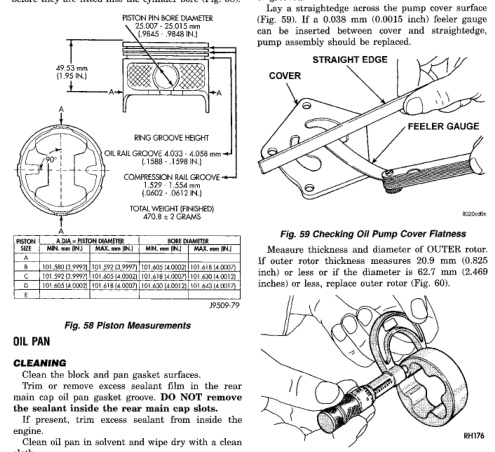

## CLEANING AND INSPECTION (Continued)

### PISTON AND CONNECTING ROD ASSEMBLY

#### INSPECTION

Check the crankshaft connecting rod journal for excessive wear, taper and scoring.

Check the cylinder block bore for out-of-round, taper, scoring and scuffing.

Check the pistons for taper and elliptical shape before they are fitted into the cylinder bore (Fig. 58).

*Fig. 58 Piston Measurements]*
- PISTON PIN BORE DIAMETER
- PISTON SKIRT DIAMETER (90° TO PISTON PIN)
- RING GROOVE HEIGHT
- OIL RAIL GROOVE 4.033 - 4.038 mm (1.588 - 1.590 IN.)
- COMPRESSION RAIL GROOVE 2.020 - 2.030 mm (0.0795 - 0.0799 IN.)
- TOTAL WEIGHT (FINISHED) 470.9 ± 2 GRAMS

| PISTON SIZE | PISTON DIAMETER | PISTON DIAMETER | PISTON DIAMETER | PISTON DIAMETER |
|-------------|-----------------|-----------------|-----------------|------------------|
| | MIN. mm (IN.) | MAX. mm (IN.) | MIN. mm (IN.) | MAX. mm (IN.) |
| A | (3) 95.0 (3.740) | (3) 95.013 (3.7406) | (2) 95.0 (3.740) | (2) 95.013 (3.7406) |
| B | (3) 95.0 (3.7402) | (3) 95.013 (3.7408) | (2) 95.0 (3.7402) | (2) 95.013 (3.7408) |
| C | (3) 95.012 (3.7407) | (3) 95.025 (3.7413) | (2) 95.012 (3.7407) | (2) 95.025 (3.7413) |
| D | (3) 95.025 (3.7412) | (3) 95.038 (3.7418) | (2) 95.025 (3.7412) | (2) 95.038 (3.7418) |

9509-79

### OIL PAN

#### CLEANING

Clean the block and pan gasket surfaces.

Trim or remove excess sealant film in the rear main cap oil pan gasket groove. DO NOT remove the sealant inside the rear main cap slots.

If present, trim excess sealant from inside the engine.

Clean oil pan in solvent and wipe dry with a clean cloth.

Clean oil screen and pipe thoroughly in clean solvent. Inspect condition of screen.

#### INSPECTION

Inspect oil drain plug and plug hole for stripped or damaged threads. Repair as necessary.

Inspect oil pan mounting flange for bends or distortion. Straighten flange, if necessary.

### OIL PUMP

#### INSPECTION

Mating surface of the oil pump cover should be smooth. Replace pump assembly if cover is scratched or grooved.

Lay a straightedge across the pump cover surface (Fig. 59). If a 0.038 mm (0.0015 inch) feeler gauge can be inserted between cover and straightedge, pump assembly should be replaced.

[Figure: Fig. 59 Checking Oil Pump Cover Flatness]
- COVER
- STRAIGHT EDGE
- FEELER GAUGE
- 9509-86

Measure thickness and diameter of OUTER rotor. If outer rotor thickness measures 20.9 mm (0.825 inch) or less or if the diameter is 62.7 mm (2.469 inches) or less, replace outer rotor (Fig. 60).

[Figure: Fig. 60 Measuring Outer Rotor Thickness]
- RH176

If inner rotor measures 20.9 mm (0.825 inch) or less, replace inner rotor and shaft assembly (Fig. 61).

Slide outer rotor into pump body. Press rotor to the side with your fingers and measure clearance between rotor and pump body (Fig. 62). If clearance