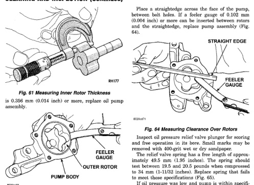
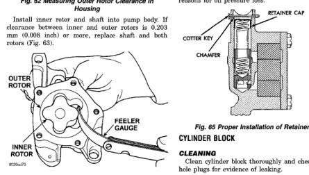

# 5.9L ENGINE 9 - 119

## CLEANING AND INSPECTION (Continued)

Place a straightedge across the face of the pump, between bolt holes. If a feeler gauge of 0.102 mm (0.004 inch) or more can be inserted between rotors and the straightedge, replace pump assembly (Fig. 64).

*Fig. 63 Measuring Inner Rotor Thickness]*

is 0.366 mm (0.014 inch) or more, replace oil pump assembly.

*Fig. 65 Measuring Outer Rotor Clearance in Housing]*
• PUMP BODY
• OUTER ROTOR
• FEELER GAUGE

Install inner rotor and shaft into pump body. If clearance between inner and outer rotors is 0.203 mm (0.008 inch) or more, replace shaft and both rotors (Fig. 63).

[Figure: Fig. 63 Measuring Clearance Between Rotors]
• OUTER ROTOR
• INNER ROTOR
• FEELER GAUGE

[Figure: Fig. 64 Measuring Clearance Over Rotors]
• STRAIGHT EDGE
• FEELER GAUGE

Inspect oil pressure relief valve plunger for scoring and free operation in its bore. Small marks may be removed with 400-grit wet or dry sandpaper.

The relief valve spring has a free length of approximately 49.5 mm (1.95 inches). The spring should test between 19.5 and 20.5 pounds when compressed to 34 mm (1-11/32 inches). Replace spring that fails to meet these specifications (Fig. 65).

If oil pressure was low and pump is within specifications, inspect for worn engine bearings or other reasons for oil pressure loss.

[Figure: Fig. 65 Proper Installation of Retainer Cap]
• RETAINER CAP
• COTTER KEY
• CHAMBER

### CYLINDER BLOCK

#### CLEANING

Clean cylinder block thoroughly and check all core hole plugs for evidence of leaking.