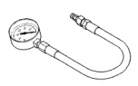
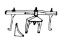
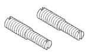
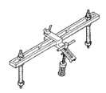

# 5.9L ENGINE 9 - 123

## SPECIFICATIONS (Continued)

| DESCRIPTION | TORQUE | DESCRIPTION | TORQUE |
|-------------|--------|-------------|--------|
| Intake Manifold | | Rear Support Plate-to-Transfer Case | |
| Bolts | Refer to R &I Procedure | Bolts | 41 N·m (30 ft. lbs.) |
| Oil Pan | | Rocker Arm | |
| Drain Plug | 24 N·m (215 in. lbs.) | Bolts | 28 N·m (21 ft. lbs.) |
| Oil Pump | | Spark Plugs | |
| Attaching Bolts | 34 N·m (25 ft. lbs.) | All | 41 N·m (30 ft. lbs.) |
| Oil Pump Cover | | Starter Motor | |
| Bolts | 11 N·m (95 in. lbs.) | Mounting Bolts | 68 N·m (50 ft. lbs.) |
| Rear Insulator-to-Bracket (2WD) | | Thermostat Housing | |
| Through-Bolt | 68 N·m (50 ft. lbs.) | Bolts | 25 N·m (225 in. lbs.) |
| Rear Insulator-to-Crossmember | | Throttle Body | |
| Bracket (2WD) | | Bolts | 21 N·m (200 in. lbs.) |
| Nut | 44 N·m (30 ft. lbs.) | Torque Converter Drive Plate | |
| Rear Insulator-to-Crossmember (4WD) | | Bolts | 41 N·m (270 in. lbs.) |
| Nuts | 68 N·m (50 ft. lbs.) | Transfer Case-to-Insulator Mounting Plate | |
| Rear Insulator-to-Transmission (4WD) | | Nuts | 68 N·m (50 ft. lbs.) |
| Bolts | 68 N·m (50 ft. lbs.) | Transmission Support Bracket (2WD) | |
| Rear Insulator Bracket (4WD Automatic) | | Bolts | 68 N·m (50 ft. lbs.) |
| Bolts | 68 N·m (50 ft. lbs.) | Vibration Damper | |
| Rear Support Bracket-to-Crossmember Flange | | Retainer Bolt | 183 N·m (135 ft. lbs.) |
| Nuts | 44 N·m (30 ft. lbs.) | Water Pump-to-Chain Case Cover | |
| | | Bolt | 41 N·m (30 ft. lbs.) |

## SPECIAL TOOLS

### 5.9L ENGINE

*Fig. 1 Oil Pressure Gauge C-3292 - U-shaped gauge tool*

*Fig. 2 Valve Spring Compressor MD-998772-A - Beam-style compressor tool*

*Fig. 3 Engine Support Fixture C-3487-A - Multi-point support fixture*

*Fig. 4 Adaptor 6633 - Two coiled spring adaptors*