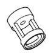
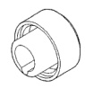
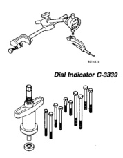
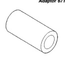
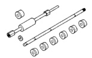
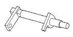
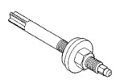

# 9 - 124 5.9L ENGINE

## SPECIAL TOOLS (Continued)

*Fig. 1 Adaptor 6716A - Cylindrical socket adaptor*

*Fig. 2 Front Oil Seal Installer 6635 - Cup-shaped seal installer tool*

*Fig. 3 Valve Guide Sleeve C-3973 - Cylindrical sleeve tool*

*Fig. 4 Cam Bearing Remover/Installer C-3132-A - Multi-piece bearing tool set with handle and various sized components*

*Fig. 5 Dial Indicator C-3339 - Dial indicator with multiple extension rods and mounting base*

*Fig. 6 Camshaft Holder C-3509 - L-shaped holding fixture*

*Fig. 7 Puller C-3688 - Multi-jaw puller tool with center screw and various attachments*

[Figure: Distributor Bushing Puller C-3052 - Shaft-style puller tool]