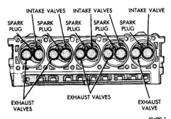

# BR — 8.0L ENGINE — 9 - 129

## DESCRIPTION AND OPERATION (Continued)

### ENGINE COMPONENTS

#### CYLINDER HEAD COVER

Die-cast magnesium cylinder head covers reduce noise and provide a good sealing surface. A steel backed silicon gasket is used with the cylinder head cover. This gasket can be used again.

#### CYLINDER HEADS

The alloy cast iron cylinder heads (Fig. 4) are held in place by 12 bolts. The spark plugs are located in the peak of the wedge between the valves.

*Fig. 4 Cylinder Head Assembly]*
- INTAKE VALVES (FRONT PLUG, MIDDLE PLUG, REAR PLUG)
- EXHAUST VALVES (FRONT VALVE, REAR VALVE)

#### VALVES AND VALVE SPRINGS

The valves are arranged in-line and inclined 18°. The rocker pivot support and the valve guides are cast integral with the heads.

#### PISTON AND CONNECTING ROD ASSEMBLY

The pistons are elliptically turned so that the diameter at the pin boss is less than its diameter across the thrust face. This allows for expansion under normal operating conditions. Under operating temperatures, expansion forces the pin bosses away from each other, causing the piston to assume a more nearly round shape.

All pistons are machined to the same weight, regardless of size, to maintain piston balance.

The piston pin rotates in the piston only and is retained by the press interference fit of the piston pin in the connecting rod.

The pistons have a unique dry-film lubricant coating baked onto the skirts to reduce friction. The lubricant is particularly effective during engine break-in, but with time, the material becomes embedded into cylinder bore walls and continues to reduce friction.

### SERVICE PROCEDURES

#### VALVE TIMING

(1) Turn crankshaft until the No.6 exhaust valve is closing and No.6 intake valve is opening.

(2) Insert a 6.350 mm (1/4 inch) spacer between rocker arm pad and stem tip of No.1 intake valve. Allow spring load to bleed tappet down giving in effect a solid tappet.

(3) Install a dial indicator so plunger contacts valve spring retainer as nearly perpendicular as possible. Zero the indicator.

(4) Rotate the crankshaft clockwise (normal running direction) until the valve has lifted 0.863 mm (0.034 inch). The timing of the crankshaft should now read from 10° before top dead center to 2° after top dead center. Use a protractor as there are no timing marks on the engine.

**CAUTION: DO NOT turn crankshaft any further clockwise as valve spring might bottom and result in serious damage.**

(5) If reading is not within specified limits:
- (a) Check sprocket index marks.
- (b) Inspect timing chain for wear.
- (c) Check accuracy of TDC mark on timing indicator.

#### MEASURING TIMING CHAIN STRETCH

(1) Place a scale next to the timing chain so that any movement of the chain may be measured.

(2) Place a torque wrench and socket over camshaft sprocket attaching bolt. Apply torque in the direction of crankshaft rotation to take up slack; 41 N·m (30 ft. lbs.) torque with cylinder head installed or 20 N·m (15 ft. lbs.) torque with cylinder head removed. With a torque applied to the camshaft sprocket bolt, crankshaft should not be permitted to move. It may be necessary to block the crankshaft to prevent rotation.

(3) Hold a scale with dimensional reading even with the edge of a chain link. With cylinder heads installed, apply 14 N·m (30 ft. lbs.) torque in the reverse direction. With the cylinder heads removed, apply 20 N·m (15 ft. lbs.) torque in the reverse direction. Note the amount of chain movement (Fig. 5).

(4) Install a new timing chain, if its movement exceeds 3.175 mm (1/8 inch).

#### FITTING PISTONS

Piston and cylinder wall must be clean and dry. Specified clearance between the piston and the cylinder wall is 0.013-0.038 mm (0.0005-0.0015 inch). The max. allowable clearance is 0.0762 mm (0.003 in.).

Piston diameter should be measured at the top of skirt, 90° to piston pin axis. Cylinder bores should be