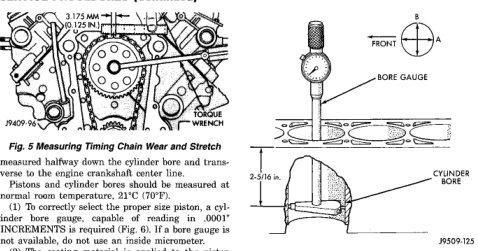

# 9 - 130 — 8.0L ENGINE — BR

## SERVICE PROCEDURES (Continued)

*Fig. 6 Measuring Timing Chain Wear and Stretch]*
- 3.175 MM (1/8 IN.) [F2]
- TORQUE WRENCH
- 2M477-A

[Figure: Fig. 6 Bore Gauge]
- FRONT
- BORE GAUGE
- CYLINDER BORE
- 2-516-A
- J9509-125

measured halfway down the cylinder bore and transverse to the engine crankshaft center line.

Pistons and cylinder bores should be measured at normal room temperature, 21°C (70°F).

(1) To correctly select the proper size piston, a cylinder bore gauge, capable of reading in .0001" INCREMENTS is required (Fig. 6). If a bore gauge is not available, do not use an inside micrometer.

(2) The coating material is applied to the piston after the final piston machining process. Measuring the outside diameter of a coated piston will not provide accurate results. Therefore measuring the inside diameter of the cylinder bore with a dial Bore Gauge is MANDATORY. To correctly select the proper size piston, a cylinder bore gauge capable of reading in .0001" increments is required.

(3) Piston installation into the cylinder bore require slightly more pressure than that required for non-coated pistons. The bonded coating on the piston will give the appearance of a line-to-line fit with the cylinder bore.

#### FITTING RINGS

(1) Measurement of end gaps:

(a) Measure piston ring gap 2 inches from bottom of cylinder bore. An inverted piston can be used to push the rings down to ensure positioning rings squarely in the cylinder bore before measuring.

(b) Insert feeler stock in the gap. Gap for compression rings should be between 0.254-0.508 mm (0.010-0.020 inch). The oil ring gap should be 0.381-1.397 mm (0.015-0.055 inch).

(c) Rings with insufficient end gap may be properly filed to the correct dimension. Ends should be stoned smooth after filing with Arkansas White Stone. Rings with excess gaps should not be used.

(2) Install rings and confirm ring side clearance:

(a) Install oil rings being careful not to nick or scratch the piston. Install the oil control rings according to instructions in the package. It is not necessary to use a tool to install the upper and lower rails. Insert oil rail spacer first, then side rails.

(b) Install the second compression rings using Installation Tool C-4184. The compression rings must be installed with the identification mark face up (toward top of piston) and chamfer facing down. An identification mark on the ring is a drill point, a stamped letter O, an oval depression or the word TOP (Fig. 7) (Fig. 9).

(c) Using a ring installer, install the top compression ring with the chamfer facing up (Fig. 9). An identification mark on the ring is a drill point, a stamped letter O, an oval depression or the word TOP facing up.

(d) Measure side clearance between piston ring and ring land. Clearance should be 0.074-0.097 mm (0.0029-0.0038 inch) for the compression rings. The steel rail oil ring should be free in groove, but should not exceed 0.246 mm (0.0097 inch) side clearance.

(e) Pistons with insufficient or excessive side clearance should be replaced.

(3) Arrange ring gaps 180° apart as shown in (Fig. 10).