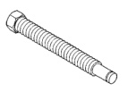
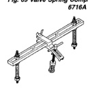
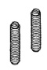
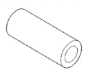
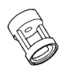

# 9 - 158 8.0L ENGINE BR

## SPECIFICATIONS (Continued)

| DESCRIPTION | TORQUE |
|-------------|--------|
| Oil Pan Pick Up Tube Bolts | 16 N·m (144 in. lbs.) |
| Oil Pump Attaching Bolts | 41 N·m (30 ft. lbs.) |
| Oil Pump Cover Bolts | 14 N·m (125 in. lbs.) |
| Oil Pump Pressure Relief Plug Plug | 20 N·m (15 ft. lbs.) |
| Rocker Arm Bolts | 28 N·m (21 ft. lbs.) |
| Spark Plugs Plugs | 41 N·m (30 ft. lbs.) |
| Starter Mounting Bolts | 68 N·m (50 ft. lbs.) |
| Timing Chain Cover Bolts | 47 N·m (35 ft. lbs.) |
| Thermostat Housing Bolts | 28 N·m (220 in. lbs.) |
| Throttle Body Nuts | 11 N·m (96 in. lbs.) |
| Transfer Case to Insulator Mounting Plate Nuts | 204 N·m (150 ft. lbs.) |
| Transmission Support Bracket Bolts | 102 N·m (75 ft. lbs.) |
| Transmission Support Cushion Bolts | 47 N·m (35 ft. lbs.) |
| Transmission Support Cushion Stud Nuts | 47 N·m (35 ft. lbs.) |
| Water Pump to Chain Case Cover Bolts | 41 N·m (30 ft. lbs.) |
| Water Pump Pulley Bolts | 22 N·m (16 ft. lbs.) |

## SPECIAL TOOLS

### 8.0L ENGINE

*Fig. 69 Valve Spring Compressor Adapter Tool 6716A]*

*Fig. 70 Valve Spring Compressor Tool MD-998772A]*

*Fig. 71 Valve Spring Compressor Screw Tool 6756]*

*Fig. 72 Black Valve Guide Sleeve Tool C6819]*

*Fig. 68 Valve Compressor Adapting Stud Tool 6715]*