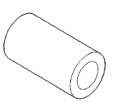
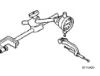
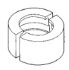
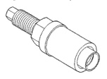
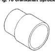
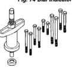
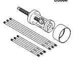

# SPECIAL TOOLS (Continued)

*Fig. 73 Silver Valve Guide Sleeve Tool C6818]*

*Fig. 77 Crankshaft Sprocket Puller Jaws Tool 6820]*

*Fig. 74 Dial Indicator Tool C3339]*

*Fig. 78 Crankshaft Sprocket Installer Tool 3718]*

*Fig. 75 Crankshaft Pulley/Damper Installer Tool C3688]*

*Fig. 79 Crankshaft Sprocket Installer Tool MD990799]*

*Fig. 76 Crankshaft Sprocket Puller Tool 6444]*

*Fig. 80 Front Oil Seal Installer Tool 6806]*