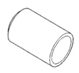
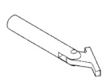
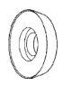
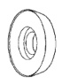
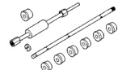
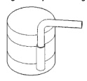
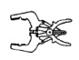

# SPECIAL TOOLS (Continued)

*Fig. 81 Front Oil Seal Installer Tool 6761]*

*Fig. 85 Seal Installer Tool 6687]*

*Fig. 82 Camshaft Bearing Installer Tool C3132A]*

*Fig. 86 Crankshaft Main Bearing Remover/Installer Tool C3059]*

*Fig. 83 Compression Ring Installer Tool C4184]*

*Fig. 87 Seal Installer Tool 6687]*

*Fig. 84 Piston Ring Compressor Tool C385]*