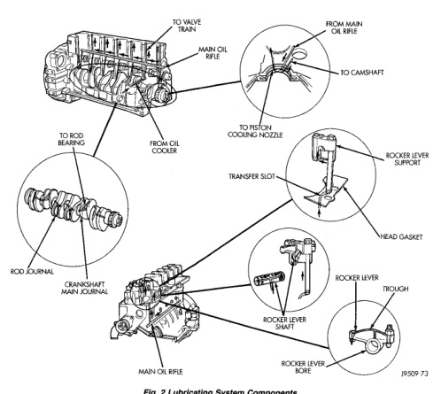

# 5.9L DIESEL ENGINE 9 - 163

## DESCRIPTION AND OPERATION (Continued)

*Fig. 2 Lubricating System Components]*
- TO VALVE TRAIN
- MAIN OIL RIFLE
- FROM MAIN OIL RIFLE
- TO CAMSHAFT
- TO ROD BEARINGS
- OIL COOLER
- TO RETURN COOLING NOZZLE
- ROCKER LEVER SUPPORT
- TRANSFER SLOT
- HEAD GASKET
- ROD JOURNAL
- CRANKSHAFT MAIN JOURNAL
- ROCKER LEVER SHAFT
- ROCKER LEVER TROUGH
- MAIN OIL RIFLE
- ROCKER LEVER BORE