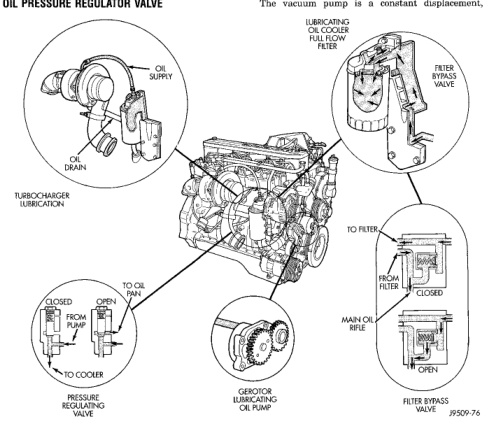

# 9 - 164 5.9L DIESEL ENGINE

## DESCRIPTION AND OPERATION (Continued)

### OIL PRESSURE REGULATOR VALVE

When oil pressure from the oil pump exceeds 448 kPa (65 psi), the regulator valve opens to allow oil to drain back into the pan.

### TIMING PIN

The timing pin is used for three different procedures:

• Valve adjustment
• Top Dead Center (TDC) location
• Fuel injector pump timing procedure

### VACUUM PUMP

The vacuum pump and the power steering pump are combined into a single assembly on diesel engine models (Fig. 4). Both pumps are operated by a drive gear attached to the vacuum pump shaft. The shaft gear is driven by the camshaft gear.

The vacuum pump is a constant displacement, vane-type pump. Vacuum is generated by four vanes mounted in the pump rotor. The rotor is located in the pump housing and is pressed onto the pump shaft.

The vacuum and steering pumps are operated by a single drive gear pressed onto the vacuum pump shaft. The drive gear is operated by the engine camshaft gear.

The vacuum and power steering pump shafts are connected by a coupling. Each pump shaft has an adapter with drive lugs that engage in the coupling. The vacuum pump rotating components are lubricated by engine oil. Lubricating oil is supplied to the pump through an oil line at the underside of the pump housing.

The complete assembly must be removed in order to service either pump. However, the power steering

*Fig. 4 Lubricating System Passages]*
- TURBOCHARGER LUBRICATION
- OIL DRAIN
- SUPPLY
- LUBRICATING OIL COOLER FULL FLOW FILTER
- FILTER BYPASS VALVE
- CLOSED/OPEN (FROM COOLER)
- CLOSED/OPEN (TO COOLER)
- PRESSURE REGULATING VALVE
- ROTOR LUBRICATING OIL PUMP
- MAIN OIL RIFLE
- TO FILTER
- FULL FLOW FILTER
- CLOSED/OPEN
- FILTER BYPASS VALVE