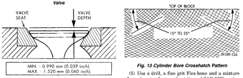

# SERVICE PROCEDURES (Continued)

*Fig. 10 Machining for Service Valve Seats—Exhaust Valve*

*Fig. 13 Valve Seat Width]*

## CYLINDER BORES—DE-GLAZE

(1) New piston rings may not seat in glazed cylinder bores.

(2) De-glazing gives the bore the correct surface finish required to seat the rings. The size of the bore is not changed by proper de-glazing.

(3) Cover the lube holes in the top of the block with waterproof tape.

(4) A correctly honed surface will have a crosshatch appearance with the lines at 15° to 25° angles (Fig. 13). For the rough hone, use 80 grit honing stones. To finish hone, use 280 grit honing stones.

[Figure: Fig. 13 Cylinder Bore Crosshatch Pattern
- TOP OF BLOCK
- 15° TO 25°]

(5) Use a drill, a fine grit Flex-hone and a mixture of equal parts of mineral spirits and SAE 30W engine oil to de-glaze the bores.

(6) The crosshatch angle is a function of drill speed and how fast the hone is moved vertically (Fig. 14).

(7) Vertical strokes MUST be smooth continuous passes along the full length of the bore (Fig. 14).

(8) Inspect the bore after 10 strokes.

(9) Use a strong solution of hot water and laundry detergent to clean the bores. Clean the cylinder bores immediately after de-glazing.

(10) Rinse the bores until the detergent is removed and blow the block dry with compressed air.

[Figure: Fig. 11 Valve Depth with Seat Insert
- VALVE SEAT
- VALVE DEPTH

MIN. - 0.990 mm (0.039 inch)
MAX. - 1.520 mm (0.060 inch)]