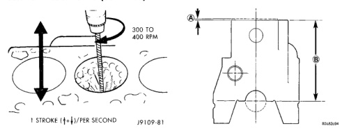
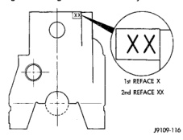

# SERVICE PROCEDURES (Continued)

*Fig. 15 De-Glazing Drill Speed and Vertical Speed]*
- 1 STROKE [++]/PER SECOND
- 300 TO 400 RPM

(11) Check the bore cleanliness by wiping with a white, lint free, lightly oiled cloth. If grit residue is still present, repeat the cleaning process until all residue is removed. Wash the bores and the complete block assembly with solvent and dry with compressed air.

(12) Be sure to remove the tape covering the lube holes after the cleaning process is complete.

## CYLINDER DECK REFACING

(1) The combustion deck can be refaced twice. The first reface should be 0.25 mm (0.0098 inch). If additional refacing is required, an additional 0.25 mm (0.0098 inch) can be removed. Total allowed refacing is 0.50 mm (0.0197 inch).

### CYLINDER BLOCK REFACING DIMENSIONS

| DIMENSION "A" | mm | (in.) |
|---|---|---|
| 1st Reface | 0.25mm | (0.0098 in.) |
| 2nd Reface | 0.25mm | (0.0098 in.) |
| Dim (A) Total | 0.50 mm | (0.0197 in.) |

| DIMENSION "B" | mm | (in.) |
|---|---|---|
| Dim. "B" (STD.) | 323.00 mm ± 0.10 mm | (12.7165 in. ± 0.0039 in.) |
| 1st Reface | 322.75 mm ± 0.10 mm | (12.7067 in. ± 0.0039 in.) |
| 2nd Reface | 322.50 mm ± 0.10 mm | (12.6968 in. ± 0.0039 in.) |

(2) The upper right corner of the rear face of the block must be stamped with a X when the block is refaced to 0.25 mm (0.0098 inch). A second X must be stamped beside the first when the block is refaced to 0.50 mm (0.0197 inch) - (Fig. 16).

(3) Consult the parts catalog for the proper head gaskets which must be used with refaced blocks to ensure proper piston-to-valve clearance.

*Fig. 16 Refacing Dimensions of the Cylinder Block]*
- DIMENSION A
- DIMENSION B

[Figure: Fig. 16 Stamp Block after Reface]
- 1st REFACE X
- 2nd REFACE XX

## CYLINDER BORE REPAIR

Cylinder bore(s) can be repaired by one of two methods:

• Method 1—Over boring and using oversize pistons and rings.
• Method 2—Boring and installing a repair sleeve to return the bore to standard dimensions.

### METHOD 1—OVERSIZE BORE

Oversize pistons and rings are available in two sizes - 0.50 mm (0.0197 inch) and 1.00 mm (0.0393 inch).

Any combination of standard, 0.50 mm (0.0197 inch) or 1.00 mm (0.0393 inch) overbore may be used in the same engine.

If more than 1.00 mm (0.0393 inch) overbore is needed, a repair sleeve can be installed (refer to Method 2—Repair Sleeve).

Cylinder block bores may be bored twice before use of a repair sleeve is required (Fig. 17). The first bore is 0.50 mm (0.0197 inch) oversize. The second bore is 1.00 mm (0.0393 inch) oversize.