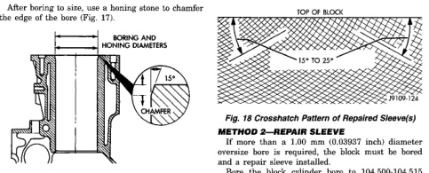
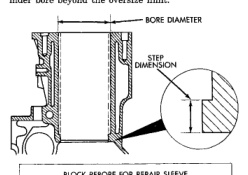

# SERVICE PROCEDURES (Continued)

After boring to size, use a honing stone to chamfer the edge of the bore (Fig. 17).

*Fig. 17 Cylinder Bore Dimensions]*
- BORING AND HONING DIAMETERS
- 1/2" CHAMFER
- 15°

| BORING DIAMETER DIMENSION | mm | (inch) |
|---|---|---|
| 1st REBORE | 102.469 mm | (4.0342 inch) |
| 2nd REBORE | 102.969 mm | (4.0539 inch) |

| HONING DIAMETER DIMENSIONS | mm | (inch) |
|---|---|---|
| STANDARD | 102.020 ±0.020 mm | (4.0165 ±0.0008 inch) |
| 1st REBORE | 102.520 ±0.020 mm | (4.0362 ±0.0008 inch) |
| 2nd REBORE | 103.020 ±0.020 mm | (4.0559 ±0.0008 inch) |

| CHAMFER DIMENSIONS |
|---|
| Approx. 1.25 mm (0.049 inch) by 15° |

A correctly honed surface will have a crosshatch appearance with the lines at 15° to 25° angles with the top of the cylinder block (Fig. 18). For the rough hone, use 80 grit honing stones. To finish hone, use 280 grit honing stones.

A maximum of 1.2 micrometer (48 microinch) surface finish must be obtained.

After finish honing is complete, immediately clean the cylinder bores with a strong solution of laundry detergent and hot water.

After rinsing, blow the block dry.

Check the bore cleanliness by wiping with a white, lint-free, lightly-oiled cloth. There should be no grit residue present.

If the block is not to be used right away, coat it with a rust-preventing compound.

*Fig. 18 Crosshatch Pattern of Repaired Sleeve(s)]*
- TOP OF BLOCK
- 15° TO 25°

### METHOD 2—REPAIR SLEEVE

If more than a 1.00 mm (0.03937 inch) diameter oversize bore is required, the block must be bored and a repair sleeve installed.

Bore the block cylinder bore to 104.500-104.515 mm (4.1142-4.1148 inch) - (Fig. 19).

Repair sleeves can be replaced by using a boring bar to bore out the old sleeve. DO NOT cut the cylinder bore beyond the oversize limit.

[Figure: Fig. 19 Block Bore for Repair Sleeve Dimensions]
- BORE DIAMETER
- STEP DIMENSION
- 15°

| BLOCK REBORE FOR REPAIR SLEEVE |
|---|
| BORE DIA. - 104.500 +0.015 mm (4.1142 +0.0006 inch) |
| STEP DIM. - 6.35 mm (0.25 inch) |

After machining the block for the new repair sleeve, thoroughly clean the bore of all metal chips, debris and oil residue before installing the sleeve.

Cool the repair sleeve(s) to a temperature of -12°C (10°F) or below for a minimum of one hour. Be ready to install the sleeve immediately after removing it from the freezer.

Apply a coat of Loctite 620, or equivalent to the bore that is to be sleeved.

Wear protective gloves to push the cold sleeve into the bore as far as possible.