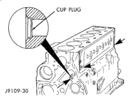

# SERVICE PROCEDURES (Continued)

Install all cam bushings flush or below the front cam bore surface. The oil hole must align to allow a 3.2 mm (0.125 inch) rod to pass through freely (Fig. 23).

*Fig. 23 Oil Hole Alignment*

*Fig. 24 Crankshaft Assembly Diagram*

## CYLINDER BLOCK CUP PLUG REPLACEMENT

(1) Remove the cup plugs from the oil passages (Fig. 24).

(2) Apply a bead of Loctite 277 around the outside diameter of the oil passage cup plugs.

(3) Drive the cup plugs in until they bottom in the bore (Fig. 24).

(4) Fill the engine with oil. Run the engine and check for leaks.

(5) Stop the engine and check the oil level with the dipstick.

[Figure: Fig. 24 Cup Plug Locations in Cylinder Block
- CUP PLUG]

*J9109-30*

## CONNECTING ROD BEARING AND CRANKSHAFT JOURNAL CLEARANCE

Measure the connecting rod bore with the bearings installed and the bolts tightened to 100 N·m (73 ft. lbs.) torque.

Record the smaller diameter.

Measure the diameter of the rod journal at the location shown (Fig. 25). Calculate the average diameter for each side of the journal.

The clearance is the difference between the connecting rod bore (smallest diameter) and the average diameter for each side of the crankshaft journal.

## Fig. 25 Connecting Rod Journal Diameter Limits

| Specification | Measurement |
|---|---|
| MIN. | 68.962 mm (2.715 inch) |
| MAX. | 69.013 mm (2.717 inch) |
| Out-of-Round - Max. | 0.050 mm (0.002 inch) |
| Taper - Max. | 0.013 mm (0.0005 inch) |
| Bearing Clearance - Max. | 0.089 mm (0.0035 inch) |

*J9109-91*

If the crankshaft is within limits, replace the bearing. If the crankshaft is out of limits, grind the crankshaft to the next smaller size and use oversize rod bearings.

## PISTON GRADING PROCEDURE

• When rebuilding an engine with the original cylinder block, crankshaft and pistons, make sure the replacement pistons are installed in their original cylinder.

• If replacing the piston(s), make sure the replacement piston(s) are the same grade as the one being replaced.

• If a new cylinder block and/or crankshaft is used, the piston grading procedure MUST be performed to determine the proper piston grade for each cylinder.

(1) Install any of the original connecting rod and piston assemblies into the No.1 cylinder. DO NOT install the piston rings.

(2) Install the upper bearing shell in the connecting rod with the tang of the bearing in the slot of the connecting rod. The connecting rod bearing shell must be installed in the original connecting rod and