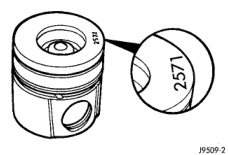

# 5.9L DIESEL ENGINE 9 - 173

## SERVICE PROCEDURES (Continued)

cap. Use clean lubricating oil to coat the inside diameter of the connecting rod bearing shell.

(3) Install the bearing shell in the connecting rod cap with the tang of the bearing in the slot to the cap. Use clean lubricating oil to coat the inside diameter of the bearing shell.

(4) The four digit number stamped on the connecting rod and cap at the parting line must match and be installed on the oil cooler side of the engine. Install the connecting rod cap and capscrews. Tighten the capscrews to 35 N·m (26 ft. lbs.) torque.

(5) Use a fine grit stone to remove any burrs from the cylinder block head deck. Zero the dial indicator to the cylinder block head deck.

(6) Move the dial indicator directly over the piston pin to eliminate any side-to-side movement.

(7) Rotate the crankshaft to top dead center (TDC). Rotate the crankshaft clockwise and counterclockwise to find the highest dial indicator reading. Record the reading.

(8) Remove the piston and connecting rod assembly from the No.1 cylinder and install the assembly into the No.2 cylinder. Repeat the procedure for every cylinder using the same piston and connecting rod assembly.

(9) Determine the grade of the piston being used by referring to the Piston Protrusion Chart below. Four digits on top of the piston can be cross referenced to a Chrysler part number for replacement (Fig. 26). If the number on the piston cannot be seen, measure from the top of the piston to the top of the piston pin to see what grade piston is used (Fig. 27).

*Fig. 26 Piston Grading Number Location - Shows piston with grading number location marked at 257°]*

NOTE: Use the table below when piston grading numbers are missing or not legible.

### PISTON PROTRUSION CHART

| IF MEASURING PISTON IS GRADING NUMBER: | H.P. (M/T) | 5 H.P. (A/T) | AND PROTRUSION IS: | USE GRADE: |
|---|---|---|---|---|
| 180 | 21 | | | |
| 2571 | 6631 | | 0.609-0.711 mm (0.024-0.028 in.) | A |
| 2571 | 6631 | | 0.508-0.609 mm (0.020-0.024 in.) | B |
| 2571 | 6631 | | 0.406-0.508 mm (0.016-0.020 in.) | C |
| 2572 | 6632 | | 0.711-0.813 mm (0.028-0.032 in.) | A |
| 2572 | 6632 | | 0.609-0.711 mm (0.024-0.028 in.) | B |
| 2572 | 6632 | | 0.508-0.609 mm (0.020-0.024 in.) | C |
| 2573 | 6633 | | 0.813-0.914 mm (0.032-0.036 in.) | A |
| 2573 | 6633 | | 0.711-0.813 mm (0.028-0.032 in.) | B |
| 2573 | 6633 | | 0.609-0.711 mm (0.024-0.028 in.) | C |

### ALTERNATIVE GRADE IDENTIFICATION METHOD

| DIMENSION "A" | REF. NUMBER | GRADE |
|---|---|---|
| 51.554-51.607 mm (2.029-2.031 in.) | 2571/6631 | A |
| 51.654-51.707 mm (2.033-2.035 in.) | 2572/6632 | B |
| 51.754-51.807 mm (2.037-2.039 in.) | 2573/6633 | C |

### CRANKSHAFT REWORK

Crankshaft main and rod journals may be ground in increments of 0.25 mm (0.0098 inch) up to a total of 1.00 mm (0.0394 inch).

The only exception is the main journal thrust width surface. This journal must be ground in increments of 0.50 mm (0.0197 inch) up to a total of 1.00 mm (0.0394 inch). The thrust surface is located on the No.6 main bearing. When the thrust surface