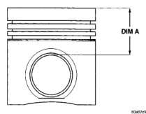
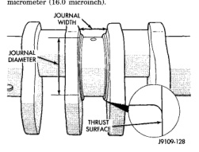

# 9 - 174 5.9L DIESEL ENGINE

## SERVICE PROCEDURES (Continued)

*Fig. 28 Piston Grading Measurement - Shows cross-section of piston with DIM A measurement indicated]*

requires grinding, the main journal must be ground to the same undersize dimension.

CAUTION: Welding of the crankshaft is not allowed. Failure of the crankshaft will result.

### MAIN JOURNAL

All main journals are to be ground in the opposite direction of engine rotation (clockwise as viewed from the front of crankshaft). Polish the journals in the same direction as engine rotation.

The main bearing grinding specifications are shown in (Fig. 28).

| STANDARD MAIN JOURNAL DIAMETER | |
|---|---|
| 83.000 ±0.013 mm (3.2677 ±0.0005 inch) | |
| WORN MAIN JOURNAL DIAMETER LIMIT | |
| 82.962 (3.2662 inch) | |
| UNDERSIZES | REGRIND TO |
| 0.25 mm (0.0098 inch) | 82.750 ±0.013 mm (3.2579 ±0.0005 inch) |
| 0.50 mm (0.0197 inch) | 82.500 ±0.013 mm (3.2480 ±0.0005 inch) |
| 0.75 mm (0.0295 inch) | 82.250 ±0.013 mm (3.2381 ±0.0005 inch) |
| 1.00 mm (0.0394 inch) | 82.000 ±0.013 mm (3.2283 ±0.0005 inch) |
| OUT-OF ROUND & TAPER (MAX.) | |
| 0.005 mm (0.0002 inch) | |
| ALL MAIN JOURNALS ARE TO BE PARALLEL TO THE FRONT AND REAR MAINS WITHIN: | |
| 0.030 mm (0.001 inch) | |

*J9109-125*

*Fig. 29 Crankshaft Main Journal Dimensions]*

Thrust journals can be ground in the same increments and using the same specifications as all other main journals. The main journal radius may be ground using either the preferred or the alternative procedure providing the thrust surface width is not being ground. The preferred procedure must be used when the main bearing thrust width surface is ground. When the thrust surface width requires grinding, the main journal must be ground to the same undersize dimension (Fig. 29).

| THRUST JOURNAL WIDTH | |
|---|---|
| 37.500 ±0.025 mm (1.4764 ±0.001 inch) | |
| UNDERSIZES | REGRIND WIDTH TO |
| 0.50 mm (0.0197 inch) | 38.000 ±0.025 mm (1.4961 ±0.001 inch) |
| 1.00 mm (0.0394 inch) | 38.500 ±0.025 mm (1.5158 ±0.001 inch) |

*J9109-127*

[Figure: Fig. 29 Crankshaft Thrust Journal Width]

#### Dimensions:

The thrust surface is to be ground on center within 0.10 mm (0.004 inch). It also must be perpendicular to the front and rear mains within 0.0015 mm (0.00006 inch) per radial inch on the thrust area (Fig. 30). The surface finish requirement is 0.04 micrometer (16.0 microinch).

[Figure: Fig. 30 Crankshaft Thrust Surface - Shows journal diameter and thrust surface with labels]

#### PREFERRED PROCEDURE:

Smoothly blend a 4.20 ±0.020 mm (0.1654 ±0.0008 inch) radius to the ground diameters (Fig. 31).

CAUTION: DO NOT use the Alternative Procedure when the thrust surface width is ground.

*J9109-128*