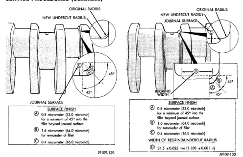

# SERVICE PROCEDURES (Continued)

*Fig. 32 Grind Crankshaft Main Journal—Preferred Method]*
- NEW UNDERCUT RADIUS
- ORIGINAL RADIUS
- JOURNAL SURFACE
- SURFACE FINISH
  - A: 0.8 micrometer (32.0 microinch) for a minimum of 45° into the fillet beyond journal surface
  - B: 1.6 micrometer (64.0 microinch) for remainder of fillet
  - C: 0.4 micrometer (16.0 microinch)

[Figure: Fig. 32 Grind Crankshaft Main Journal—Alternative Method]
- NEW UNDERCUT RADIUS
- ORIGINAL RADIUS
- JOURNAL SURFACE
- REGRIND WIDTH
- SURFACE FINISH
  - A: 0.8 micrometer (32.0 microinch) for a minimum of 45° into the fillet beyond journal surface
  - B: 1.6 micrometer (64.0 microinch) for remainder of fillet
  - C: 0.4 micrometer (16.0 microinch)
- WIDTH OF REGRIND/UNDERCUT RADIUS
  - D: 34.5 ±0.025 mm (1.360 ±0.001 in)

**ALTERNATIVE PROCEDURE:**

Smoothly blend a 1.25 ±0.020 mm (0.0492 ±0.0008 inch) radius to the ground diameters (Fig. 32).

## ROD JOURNAL

All rod journals are to be ground in the opposite direction of engine rotation (clockwise as viewed from the front of crankshaft). Polish the journals in the same direction as engine rotation.

The rod bearing grinding specifications are shown in (Fig. 33).

**PREFERRED PROCEDURE:**

Smoothly blend a 4.00 ±0.020 (0.1575 ±0.0008 inch) radius to the ground diameters and side faces (Fig. 34).

**ALTERNATIVE PROCEDURE:**

Smoothly blend a 1.25 ±0.020 mm (0.0492 ±0.0008 inch) radius to the ground journals (Fig. 35).

## MAIN BEARING CLEARANCE

Inspect the main bearing bores for damage or abnormal wear.

**Fig. 33 Crankshaft Rod Journal Dimensions**

| Specification | Value |
|--------------|-------|
| STANDARD ROD JOURNAL DIAMETER | 69.000 ±0.013 mm (2.7165 ±0.0005 inch) |
| WORN ROD JOURNAL DIAMETER LIMIT | 68.962 (2.7150 inch) |
| **UNDERSIZES** | **REGRIND TO** |
| 0.25 mm (0.0098 inch) | 68.750 ±0.013 mm (2.7067 ±0.0005 inch) |
| 0.50 mm (0.0197 inch) | 68.500 ±0.013 mm (2.6969 ±0.0005 inch) |
| 0.75 mm (0.0295 inch) | 68.250 ±0.013 mm (2.6870 ±0.0005 inch) |
| 1.00 mm (0.0394 inch) | 68.000 ±0.013 mm (2.6772 ±0.0005 inch) |
| OUT-OF ROUND & TAPER (MAX.) | 0.005 mm (0.0002 inch) |

ALL MAIN JOURNALS ARE TO BE PARALLEL TO THE FRONT AND REAR MAINS WITHIN 0.030 mm (0.001 inch)

J9109-126