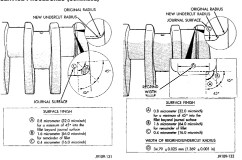
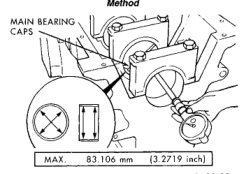

# SERVICE PROCEDURES (Continued)

*Fig. 36 Crankshaft Rod Journal Grind—Preferred Method]*
- NEW UNDERCUT RADIUS
- ORIGINAL RADIUS
- JOURNAL SURFACE
- SURFACE FINISH
  - A: 0.8 micrometer (32.0 microinch) for a minimum of 45° into the fillet beyond journal surface
  - B: 1.6 micrometer (64.0 microinch) for remainder of fillet
  - C: 0.4 micrometer (16.0 microinch)

*Fig. 37 Grind Crankshaft Rod Journal—Alternative Method]*
- NEW UNDERCUT RADIUS
- ORIGINAL RADIUS
- JOURNAL SURFACE
- REGRIND WIDTH
- SURFACE FINISH
  - A: 0.8 micrometer (32.0 microinch) for a minimum of 45° into the fillet beyond journal surface
  - B: 1.6 micrometer (64.0 microinch) for remainder of fillet
  - C: 0.4 micrometer (16.0 microinch)
- WIDTH OF REGRIND/UNDERCUT RADIUS
  - D: 34.70 ±0.025 mm (1.360 ±0.001 in)

Install the crankshaft main bearings and measure main bearing bore diameter with the main bolts tightened to 176 N·m (130 ft. lbs.) torque (Fig. 36).

Measure the diameter of the main journal at the locations shown (Fig. 37). Calculate the average diameter for each side of the journal.

Calculate the main bearing journal to bearing clearance, the clearance specifications are 0.119 mm (0.00475 inch). If the crankshaft journal is within limits, replace the main bearings. If not within specifications, grind the crankshaft to next size and use oversize bearings.

## REMOVAL AND INSTALLATION

### ENGINE FRONT MOUNTS

**REMOVAL**

(1) Disconnect the negative cable from the battery.
(2) Position fan to assure clearance for radiator top tank and hose.
(3) Install engine support/lifting fixture.
(4) Raise vehicle on hoist.
(5) Lift the engine SLIGHTLY and remove the thru-bolt and nut (Fig. 38).

[Figure: Fig. 36 Crankshaft Main Bearing Bore Diameter]
- MAIN BEARING CAPS
- MAX. 83.106 mm (3.2719 inch)

J9109-92

(6) Remove engine support bracket/cushion bolts (Fig. 38). Remove the support bracket/cushion.

**INSTALLATION**

(1) With engine raised SLIGHTLY, position the engine support bracket/cushion to the block. Install new bolts and tighten to 189 N·m (140 ft. lbs.) torque.