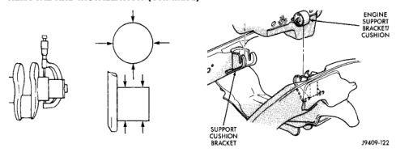
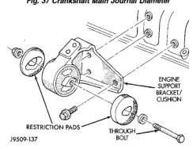

# 5.9L DIESEL ENGINE 9 - 177

## REMOVAL AND INSTALLATION (Continued)

*Fig. 37 Crankshaft Main Journal Diameter - showing crankshaft with measurement points and restriction pads]*

| Specification | Measurement (mm) | Measurement (inch) |
|---------------|------------------|--------------------|
| MIN. | 82.962 mm | (3.2662 inch) |
| MAX. | 83.103 mm | (3.2682 inch) |

J9109-93

*Fig. 39 Front Engine Mounts - showing engine support bracket/cushion, restriction pads, and through bolt]*

J9509-137

(2) Install the thru-bolt into the engine support bracket/cushion.

(3) Lower engine with support/lifting fixture while guiding the engine bracket/cushion and thru-bolt into support cushion brackets (Fig. 39).

(4) Install thru-bolt nuts and tighten the nuts to 68 N·m (50 ft. lbs.) torque.

(5) Lower the vehicle.

(6) Remove lifting fixture.

### ENGINE REAR MOUNT

#### REMOVAL

(1) Raise the vehicle on a hoist.

(2) Position a transmission jack in place.

(3) Remove support cushion stud nuts (Fig. 40).

[Figure: Fig. 39 Positioning Engine Front Mounts - showing engine support bracket, support cushion bracket, and cushion]

J9509-123

(4) Raise rear of transmission and engine SLIGHTLY.

(5) Remove the bolts holding the support cushion to the transmission support bracket. Remove the support cushion.

(6) If necessary, remove the bolts holding the transmission support bracket to the transmission.

#### INSTALLATION

(1) If removed, position the transmission support bracket to the transmission. Install new attaching bolts and tighten to 102 N·m (75 ft. lbs.) torque.

(2) Position support cushion to transmission support bracket. Install stud nuts and tighten to 47 N·m (35 ft. lbs.) torque.

(3) Using the transmission jack, lower the transmission and support cushion onto the crossmember (Fig. 40).

(4) Install the support cushion bolts and tighten to 47 N·m (35 ft. lbs.) torque.

(5) Remove the transmission jack.

(6) Lower the vehicle.

### ENGINE ASSEMBLY

#### REMOVAL

(1) Remove the battery.

(2) Drain cooling system (refer to Group 7, Cooling System for the proper procedure).

(3) Remove the upper crossmember and top core support.

(4) Remove the transmission oil cooler.

(5) Discharge the air conditioning system, if equipped (refer to Group 24, Heating and Air Conditioning for service procedures).

(6) Remove the serpentine belt (refer to Group 7, Cooling System).

(7) Remove the A/C compressor with the lines attached. Set aside.