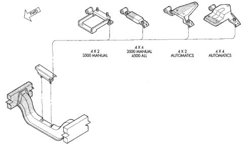
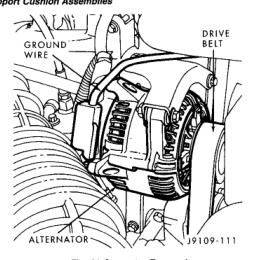

# 9 - 178 5.9L DIESEL ENGINE

## REMOVAL AND INSTALLATION (Continued)

*Fig. 41 Engine Rear Support Cushion Assemblies - showing four variants: 4 X 2 3500 MANUAL, 4 X 4 3500 MANUAL 4500 ALL, 4 X 2 AUTOMATICS, 4 X 4 AUTOMATICS]*

J9509-126

(8) If equipped, remove the condenser.

(9) Remove the washer bottle.

(10) Remove the radiator overflow bottle.

(11) Disconnect the top radiator hose.

(12) Remove the fan.

(13) Remove the fan shroud.

(14) Disconnect the lower radiator hose.

(15) Remove radiator (refer to Group 7, Cooling System).

(16) Remove the generator (Fig. 41) with the wire connections (refer to Group 8B, Battery/Starter/Generator Service).

(17) Disconnect the heater hoses at the dash panel and at the water valve (Fig. 42).

(18) Disconnect the air inlet tube from the turbocharger (Fig. 43) and the air intake housing. Remove the tube.

(19) Remove the exhaust pipe from the turbocharger outlet flange (Fig. 43).

(20) Disconnect the intercooler inlet duct from the turbocharger and the intercooler. Remove the inlet duct.

(21) Disconnect the intercooler outlet duct from the air inlet housing and the intercooler. Remove the outlet duct.

(22) Disconnect the accelerator linkage, the speed control linkage and the throttle valve linkage.

*Fig. 42 Generator Removal - showing alternator, drive belt, and grounding wire]*

J9109-111

(23) Disconnect the power steering hoses, if equipped.

(24) Disconnect the transmission cooler lines.