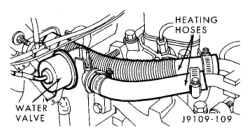
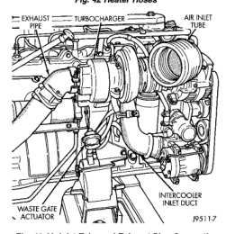

# BR 5.9L DIESEL ENGINE 9-179

## REMOVAL AND INSTALLATION (Continued)

*Fig. 42 Heater Hoses]*
- HEATING HOSES
- WATER PUMP
- WATER VALVE

*Fig. 2 Air Inlet Tube and Exhaust Pipe Connection]*
- TURBOCHARGER
- AIR INLET TUBE
- EXHAUST PIPE
- INTERCOOLER INLET DUCT
- WASTE GATE SOLENOID

(25) Disconnect all electrical connections from the engine. Put tags on the connections to identify their locations.

(26) Disconnect the fuel lines to the lift pump and fuel return. Use tags to identify the lines.

(27) On Manual Transmission vehicles, remove the shift lever (refer to Group 21, Transmissions).

(28) Raise and support the vehicle on a hoist.

(29) Drain the engine lubricating oil. Dispose of the oil according to all applicable regulations.

(30) Remove the oil pan.

(31) Remove engine front mount thru-bolt nuts.

(32) Remove the transmission cooler line brackets from oil pan.

(33) Disconnect exhaust pipe at manifold.

(34) Disconnect the starter wires. Remove starter motor (refer to Group 8B, Battery/Starter/Generator Service).

(35) Remove the dust shield and transmission cover.

(36) Refer to Group 21, Transmissions for transmission removal.

(37) Lower the vehicle.

(38) Put a cover or tape over all engine openings.

(39) Lift the engine out of the vehicle.

(40) Install the engine on a suitable stand.

(41) Remove all accessories and brackets not previously removed for use with the replacement engine.

### INSTALLATION

(1) Check the data plate to verify that the replacement engine is the same model and rating as the engine that was removed.

(2) Install all accessories and brackets that had been removed from the previous engine.

(3) Use the lifting brackets to lift the engine off of the stand.

(4) Position the engine in the chassis with the thru-bolt installed.

(5) Remove the covers or tape covering the engine openings.

(6) Raise and support the vehicle.

(7) Refer to Group 21, Transmissions for transmission installation.

(8) Install the dust shield and transmission cover.

(9) Install the prop shaft (refer to Group 16, Propeller Shaft).

(10) Install the starter motor (refer to Group 8B, Battery/Starter/Generator Service). Connect the starter wires.

(11) Install the transmission cooler line brackets to oil pan.

(12) Install and tighten engine front mount thru-bolt nuts.

(13) Install the oil pan. Install the drain plug.

(14) Lower the vehicle.

(15) On Manual Transmission vehicles, install the shift lever (refer to Group 21, Transmissions).

(16) Connect the fuel lines to the lift pump and fuel return. Use tags to identify the lines.

(17) Connect all electrical connections to the engine. Use tags to identify their locations.

(18) Connect the transmission cooler lines.

(19) Connect the power steering hoses, if equipped.

(20) Connect the accelerator linkage, the speed control linkage and the throttle valve linkage.

(21) Install the outlet duct. Connect the intercooler outlet duct to the air inlet housing and the intercooler.

(22) Install the inlet duct. Connect the intercooler inlet duct to the turbocharger and the intercooler.

(23) Install the exhaust pipe to the turbocharger outlet flange.

(24) Install the air inlet tube. Connect the air inlet tube to the turbocharger and the air intake housing.

(25) Connect the heater hoses at the dash panel and at the water valve.