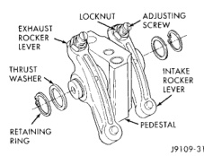
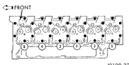

# 9-180 5.9L DIESEL ENGINE BR

## REMOVAL AND INSTALLATION (Continued)

(26) Install the generator and wire connections (refer to Group 8B, Battery/Starter/Generator Service).

(27) Install the radiator (refer to Group 7, Cooling System).

(28) Connect the lower radiator hose.

(29) Install the fan shroud.

(30) Install the fan.

(31) Connect the top radiator hose.

(32) Install the radiator overflow bottle.

(33) Install the washer bottle.

(34) If equipped, install the condenser.

(35) Install the A/C compressor with the lines attached.

(36) Evacuate and charge the air conditioning system, if equipped (refer to Group 24, Heating and Air Conditioning for service procedures).

(37) Install the transmission oil cooler.

(38) Install the upper crossmember and top core support.

(39) Install the serpentine belt (refer to Group 7, Cooling System).

(40) Fill the cooling system with a mixture of 50% water and 50% ethylene-glycol base antifreeze (refer Group 7, Cooling System for the proper procedure).

(41) Fill the engine with the required amount of clean engine lubricating oil (refer to Group 0, Lubrication and Maintenance).

(42) Install the battery and connect the battery cables.

(43) Check the oil level after the engine has run for 2 or 3 minutes. Oil held in the oil filter and oil passages will cause the oil level in the pan to be lower than normal for a short period of time.

(44) Operate the engine at idle for 5 to 10 minutes and check for leaks and loose parts.

## ROCKER LEVERS AND PUSH RODS

### REMOVAL

(1) Remove the EGR tube and gaskets.

(2) Remove the valve covers.

(3) Loosen the adjusting screw locknuts. Loosen the adjusting screws until they stop (Fig. 44).

(4) Remove the bolts from the rocker lever pedestals. Remove the pedestals and rocker lever assemblies (Fig. 44).

(5) Remove the push rods. The rear two push rods must be raised through holes in cab overhang.

### INSTALLATION

(1) Make sure the dowel rings in the pedestals are installed into the dowel bores in the cylinder head.

(2) If the push rod is holding pedestal off head, bar the engine until the pedestal will set on the head surface without interference.

*Fig. 44 Location of Rocker Lever Components]*
- LOCKNUT
- ADJUSTING SCREW
- EXHAUST ROCKER LEVER
- INTAKE ROCKER LEVER
- THRUST WASHER
- PEDESTAL
- RETAINING RING

(3) Use clean engine oil to lubricate the cylinder head bolt threads and under the bolt heads.

(4) Install the long bolts (12 mm) into the rocker lever pedestals. Tighten the bolts as follows:

- Step 1—Tighten the bolts, in sequence (Fig. 45), to 90 N·m (66 ft. lbs.) torque. Check the torque. If lower than 90 N·m (66 ft. lbs.), tighten to this torque.

- Step 2—Tighten the bolts, in sequence (Fig. 45), to 120 N·m (89 ft. lbs.) torque. Check the torque. If lower than 120 N·m (89 ft. lbs.), tighten to this torque.

- Step 3—Tighten the bolts, in sequence (Fig. 45), an additional 90°.

*Fig. 45 Rocker Lever (Head Bolts) Tightening Sequence]*
- FRONT (with numbered bolt positions 1-12)

(5) Tighten the 8 mm bolts to 24 N·m (18 ft. lbs.) torque.

(6) Install the valve cover. Tighten the valve cover bolt to 24 N·m (18 ft. lbs.) torque.

(7) Install the EGR tube and start fasteners by hand.

(8) Tighten all bolts/nuts to 24 N·m (212 in-lbs.) torque. When tightening bolts at EGR valve end of tube, alternate between the upper and lower bolt to allow face of EGR valve to remain square to tube mounting flange on EGR tube.