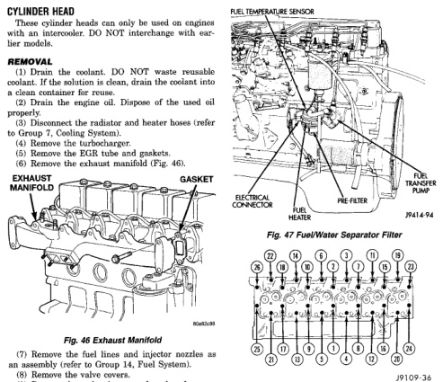

# 5.8L DIESEL ENGINE — 9-181

## REMOVAL AND INSTALLATION (Continued)

### CYLINDER HEAD

**These cylinder heads can only be used on engines with an intercooler. DO NOT interchange with earlier models.**

#### REMOVAL

(1) Drain the coolant. DO NOT waste reusable coolant. If the solution is clean, drain the coolant into a clean container for reuse.

(2) Drain the engine oil. Dispose of the used oil properly.

(3) Disconnect the radiator and heater hoses (refer to Group 7, Cooling System).

(4) Remove the turbocharger.

(5) Remove the EGR tube and gaskets.

(6) Remove the exhaust manifold (Fig. 46).

*Fig. 47 Exhaust Manifold - Illustration showing exhaust manifold assembly with gaskets]*

(7) Remove the fuel lines and injector nozzles as an assembly (refer to Group 14, Fuel System).

(8) Remove the valve covers.

(9) Remove the rocker levers and push rods.

(10) Remove the fuel filter/water separator (Fig. 47). Refer to Group 14, Fuel System, for the proper procedures. Remove the remote fuel filter/water separator head.

(11) If the engine is hot, remove the cylinder head bolts in the sequence shown in (Fig. 48). The removal sequence is not important if the engine is cold. There are 3 sizes of head bolts. Note the position of each bolt for future installation.

(12) Remove the cylinder head and gasket from the cylinder block.

[Figure: Fig. 47 Fuel/Water Separator Filter - Diagram showing:
- Fuel temperature sensor
- Drain
- Electrical connector
- Fuel filter
- Fuel heater
- Oil transfer pump]

[Figure: Fig. 48 Cylinder Head Bolt Removal Sequence—Cylinder Head - Diagram showing numbered bolt positions in two rows with sequence numbers]

#### INSTALLATION

(1) The cylinder block and head must be clean and dry.

(2) Position the gasket onto the dowels (Fig. 49). Make sure the gasket is correctly aligned with the holes in the cylinder block.

(3) Carefully put the cylinder head onto the gasket and cylinder block. Make sure the cylinder head is installed onto the dowels in the cylinder block (Fig. 49).

(4) Install the push rods and rocker levers.

(5) Use clean engine oil to lubricate the cylinder head bolt threads and under the bolt heads.

(6) The cylinder head bolts are 3 different sizes. Install the bolts in the proper hole. Tighten the bolts as follows:

- Step 1—Tighten all bolts, in sequence (Fig. 50), to 90 N·m (66 ft. lbs.) torque. Check the torque. If lower than 90 N·m (66 ft. lbs.), tighten to this torque.
- Step 2—Tighten all long 12 mm bolts (Nos. 4, 5, 12, 13, 20 and 21), in sequence (Fig. 50), to 120 N·m