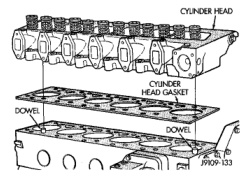
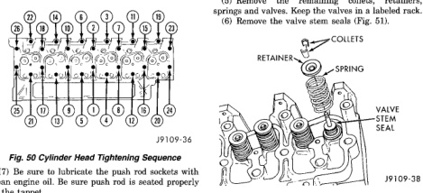

# 9-182 5.8L DIESEL ENGINE — BR

## REMOVAL AND INSTALLATION (Continued)

*Fig. 50 Cylinder Head/Gasket Alignment - Diagram showing cylinder head with gasket, dowels, and cylinder block assembly]*

(89 ft. lbs.) torque. Check the torque. If lower than 120 N·m (89 ft. lbs.), tighten to this torque.

- Step 3—Tighten all bolts, in sequence (Fig. 50), an additional 90°.

*Fig. 51 Cylinder Head Tightening Sequence - Diagram showing numbered bolt positions in two rows with sequence numbers]*

(7) Be sure to lubricate the push rod sockets with clean engine oil. Be sure push rod is seated properly in the tappet.

(8) Install the rocker lever pedestal bolts and tighten to 24 N·m (18 ft. lbs.) torque.

(9) Adjust the valve clearance.

(10) Install the valve covers. Tighten the bolts to 24 N·m (18 ft. lbs.) torque.

(11) Install the injector nozzles and fuel lines (refer to Group 14, Fuel System).

(12) Install the remote fuel filter/water separator head. Install the fuel filter/water separator (refer to Group 14, Fuel System for the proper procedures).

(13) Install the exhaust manifold (refer to Group 11, Exhaust System and Intake Manifold).

(14) Install the EGR tube and start fasteners by hand.

(15) Tighten all bolts/nuts to 24 N·m (212 in. lbs.) torque. **When tightening bolts at EGR valve end of tube, alternate between the upper and lower bolt to allow face of EGR valve to remain square to tube mounting flange on EGR tube.**

(16) Install the turbocharger.

(17) Connect the radiator and heater hoses.

(18) Fill the engine with new coolant or the clean drained coolant (refer to Group 7, Cooling System for the proper procedure).

(19) Fill the engine with clean lubricating oil (refer to Group 0, Lubrication and Maintenance).

### VALVES AND VALVE SPRINGS

#### REMOVAL

(1) Remove the cylinder head (Refer to Cylinder Head Removal and Installation in this section).

(2) Mark the valves to identify their position.

(3) Compress the valve spring and remove the valve stem collets (Fig. 51).

(4) Release valve spring and remove the retainer and spring (Fig. 51).

(5) Remove the remaining collets, retainers, springs and valves. Keep the valves in a labeled rack.

(6) Remove the valve stem seals (Fig. 51).

[Figure: Fig. 51 Valve Removal - Diagram showing valve assembly components:
- Collets
- Retainer
- Spring
- Valve stem seal
- Valve]

#### INSTALLATION

(1) Clean all cylinder head components before assembling.

(2) Install the valve stem seals (Fig. 52). The intake and exhaust valve seals are the same.

(3) Lubricate the stems with SAE 90W oil before installing the valves. Install the valves in the same positions as removed.

(4) Compress the valve spring after installing the spring and retainer (Fig. 53).

(5) Install new valve collets and release the spring tension (Fig. 53).