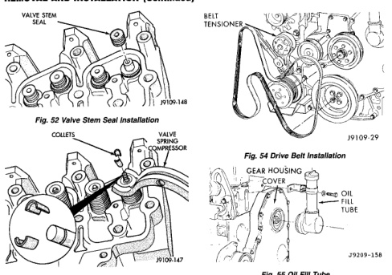
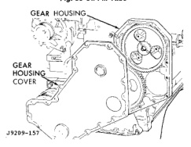

# 5.9L DIESEL ENGINE 9-183

## REMOVAL AND INSTALLATION (Continued)

*Fig. 52 Valve Stem Seal Installation]*
- VALVE STEM
- SEAL

*Fig. 54 Valve, Valve Spring and Collet Installation]*
- COLLET
- VALVE COMPRESSOR

**WARNING: WEAR PROTECTIVE EQUIPMENT AND DO NOT STAND IN LINE WITH THE VALVE STEM WHEN TAPPING THE MALLET.**

(6) Tap the ends of the valve stems with a mallet to verify the collets are seated.

(7) Install the cylinder head (Refer to Cylinder Head Removal and Installation in this section).

(8) Check the valve clearance adjustment.

### GEAR HOUSING COVER

#### REMOVAL

(1) Remove fan drive assembly.

(2) Remove the fan belt (Fig. 54).

(3) Remove belt tensioner (Fig. 54).

(4) Remove oil fill tube and adaptor (Fig. 55).

(5) Remove vibration damper.

(6) Remove the bolts that hold the gear cover to the gear housing.

(7) Gently pry the cover away from the housing, taking care not to mar the gasket surfaces (Fig. 56).

(8) Clean the old gasket residue from the back of the gear cover and front of the gear housing.

[Figure: Fig. 54 Drive Belt Installation]
- BELT TENSIONER

[Figure: Fig. 55 Oil Fill Tube]
- GEAR HOUSING COVER
- OIL FILL TUBE

[Figure: Fig. 56 Gear Housing and Cover]
- GEAR HOUSING
- GEAR HOUSING COVER

#### INSTALLATION

(1) Lubricate the front gear train with clean engine oil.

(2) Thoroughly clean the front seal area of the crankshaft. The seal lip and the sealing surface on the crankshaft must be free from all oil residue to prevent seal leaks.

(3) Apply a bead of Loctite 277 to the outside diameter of the seal.